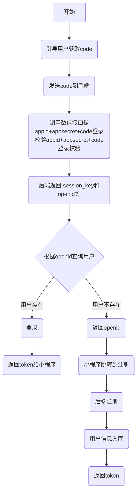

# 1. 登录

## 1.1 申请小程序

1. 登录**微信公众平台**

2. 注册小程序

   

3. 设置小程序基本信息

   

4. 复制APPID，在设置->账号信息中，复制自己的AppId到HBuilderX中

   

   在HBuilderX中，打开manifest.json，找到微信小程序配置，粘贴过去。

## 1.2 微信登录


1. 前端提供一个APP首页（不是商城首页），在进入首页的时候获取用户的code，发送给后端
2. 后端通过code请求微信后台，获取openid、unionid等
3. 根据openid查询用户
   1. 如果用户存在，直接登录，生成token并返回
   2. 如果用户不存在，直接返回openid，前端跳到商城首页，并保留openid。
      1. 用户进入登录页，点击微信登录按钮，调用获取用户信息的接口，并请求数据库。因为微信不允许在用户不授权的情况下获取用户信息，因此必须引导用户点击对应的按钮 。
      2. 前端跳转到注册页，我们这里可以叫绑定手机号
      3. 调用绑定手机号接口
      4. 后端将手机号和openid绑定存到数据库。
      5. 生成token并返回。

微信登录的流程图如下。



## 1.3 登录逻辑

### 1.3.1 前端获取code

目前我们已经有了商城首页，还没有小程序首页，我们先开发小程序首页，首页很简单，就是一个空白页底部显示 logo。有能力的同学也可以自己开发一个花里胡哨的首页。

实际上模板已经为我们提供了首页，只是默认不是启动页而已。我们只需要将其配置到第一个路由即可。

#### 路由配置

```json
{
			"path": "pages/index/index",
			"style": {
				// #ifdef APP-PLUS
				"navigationStyle": "custom",
				"app-plus": {
					"titleNView": false //去掉当前页的顶部导航栏
				},
				"navigationBarTextStyle": "white",
				// #endif
				// #ifdef MP
				"navigationBarTitleText": "波奇商城",
				"navigationBarBackgroundColor": "#FFFFFF",
				// #endif
				"h5": {
					"titleNView": false
				}
			}
		}, 
```

接下来就是获取code。这里只需要调用 `uni.login` 即可。

#### 启动页

```js
		onLoad() {
			uni.login({
				provider:"weixin",
				success: (res) => {
					// 获取微信登录用的code
					const code = res.code
				}
			})
		},
```

### 1.3.2 后端处理登录

下面开始写接口

#### application.yml

[微信登录接口文档](https://developers.weixin.qq.com/miniprogram/dev/api-backend/open-api/login/auth.code2Session.html)

登录微信公众平台，点击左侧菜单的“开发”，选择“开发设置”，复制我们的appID和AppSecret。并将这些参数配置到系统中。


**application.yml**

```yaml
wechat:
  appId: wx5068417ed65c6f6a
  appSecret: 6343c8bf505b47d60f3379a90f82594e
  grantType: authorization_code
  loginUrl: https://api.weixin.qq.com/sns/jscode2session


```

#### WeChatConfig

```java
package com.jg.pochi.config;

import lombok.Data;
import org.springframework.boot.context.properties.ConfigurationProperties;
import org.springframework.stereotype.Component;

/**
 * @Author: 杨德石
 * @Date: 2020/10/17 20:59
 * @Version 1.0
 */
@Data
@Component
@ConfigurationProperties(prefix = "wechat")
public class WeChatConfig {

    private String appId;
    private String appSecret;
    private String grantType;
    private String loginUrl;

    public String getAuthUrl(String code) {
        // https://api.weixin.qq.com/sns/jscode2session?appid=APPID&secret=SECRET&js_code=JSCODE&grant_type=authorization_code
        return loginUrl + "?appid=" + appId + "&secret=" + appSecret + "&js_code=" + code + "&grant_type=" + grantType;
    }

}

```

#### WeChatResult

微信的返回结果我们也需要一个实体类进行接收

```java
package com.jg.pochi.config;

import com.alibaba.fastjson.annotation.JSONField;
import lombok.Data;

/**
 * @Author: 杨德石
 * @Date: 2020/10/17 21:10
 * @Version 1.0
 */
@Data
public class WeChatResult {
    
    @JSONField(name = "openid")
    private String openId;
    @JSONField(name = "session_key")
    private String sessionKey;
    @JSONField(name = "unionid")
    private String unionId;
    @JSONField(name = "errcode")
    private String errCode;
    @JSONField(name = "errmsg")
    private String errMsg;
    
}

```

#### ShopUser

```java
package com.jg.pochi.pojo;

import com.jg.pochi.framework.annotation.mybatis.Column;
import com.jg.pochi.framework.annotation.mybatis.Id;
import com.jg.pochi.framework.annotation.mybatis.Table;
import lombok.Data;

import java.io.Serializable;
import java.math.BigDecimal;

/**
 * <p>
 * 会员表实体类
 * </p>
 *
 * @author 杨德石
 * @date 2020-09-22 17:43:33
 * @Version 1.0
 */
@Data
@Table(name = "shop_user")
public class ShopUser implements Serializable {

    private static final long serialVersionUID = 981816007678159811L;

    /**
     * id
     */
    @Id
    @Column(name = "id")
    private Long id;

    /**
     * 手机号
     */
    @Column(name = "phone")
    private String phone;

    /**
     * 密码
     */
    @Column(name = "password")
    private String password;

    /**
     * 昵称
     */
    @Column(name = "nickname")
    private String nickname;

    /**
     * 状态，1正常0封禁
     */
    @Column(name = "status")
    private Integer status;

    /**
     * 头像
     */
    @Column(name = "header")
    private String header;

    /**
     * 性别，1男2女
     */
    @Column(name = "gender")
    private Integer gender;

    /**
     * 签名
     */
    @Column(name = "note")
    private String note;

    /**
     * openid
     */
    @Column(name = "openid")
    private String openid;

    /**
     * 积分
     */
    @Column(name = "point")
    private BigDecimal point;

    /**
     * 历史积分
     */
    @Column(name = "history_point")
    private BigDecimal historyPoint;

    /**
     * 创建时间
     */
    @Column(name = "create_time")
    private String createTime;

    /**
     * 更新时间
     */
    @Column(name = "update_time")
    private String updateTime;

    /**
     * 是否删除，1是0否
     */
    @Column(name = "deleted")
    private Integer deleted;

    public LoginUser toLoginUser() {
        LoginUser user = new LoginUser();
        user.setId(id);
        user.setUsername(phone);
        user.setPassword(password);
        user.setNickName(nickname);
        user.setHeader(header);
        user.setOpenid(openid);
        return user;
    }

}

```


#### WeChatController

接下来写登录逻辑

```java
package com.jg.pochi.controller;

import com.alibaba.fastjson.JSON;
import com.jg.pochi.config.WeChatConfig;
import com.jg.pochi.config.WeChatResult;
import com.jg.pochi.shiro.UserRealm;
import com.jg.pochi.shiro.UserToken;
import com.jg.pochi.utils.HttpUtils;
import com.jg.pochi.utils.Result;
import org.apache.shiro.SecurityUtils;
import org.apache.shiro.authc.AuthenticationException;
import org.apache.shiro.authc.AuthenticationToken;
import org.apache.shiro.subject.Subject;
import org.springframework.beans.factory.annotation.Autowired;
import org.springframework.web.bind.annotation.PathVariable;
import org.springframework.web.bind.annotation.RequestMapping;
import org.springframework.web.bind.annotation.RequestMethod;
import org.springframework.web.bind.annotation.RestController;

import java.io.IOException;
import java.io.Serializable;
import java.util.HashMap;
import java.util.Map;

/**
 * 微信
 * @Author: 杨德石
 * @Date: 2020/10/17 20:49
 * @Version 1.0
 */
@RestController
@RequestMapping("/weChat")
public class WeChatController {

    @Autowired
    private WeChatConfig weChatConfig;

    @RequestMapping(value = "/wxLogin/{code}", method = RequestMethod.GET)
    public Result<Object> weLogin(@PathVariable String code) throws IOException {
        String body = HttpUtils.get(weChatConfig.getAuthUrl(code)).body();
        WeChatResult weChatResult = JSON.parseObject(body, WeChatResult.class);
        Subject subject = SecurityUtils.getSubject();
        AuthenticationToken authenticationToken = new UserToken(weChatResult.getOpenId(), weChatResult.getOpenId(), UserRealm.class);
        try {
            subject.login(authenticationToken);
        } catch (AuthenticationException e) {
            e.printStackTrace();
            // 说明openid对应用户不存在
            return new Result<>(weChatResult);
        }
        Serializable sessionId = subject.getSession().getId();
        Map<String, Object> returnMap = new HashMap<>(2);
        returnMap.put("token", sessionId);
        return new Result<>(returnMap);
    }

}

```

#### UserRealm

我们实际处理登录逻辑的地方在这里。

```java
package com.jg.pochi.shiro;

import com.jg.pochi.pojo.LoginUser;
import com.jg.pochi.pojo.ShopUser;
import com.jg.pochi.service.ShopUserService;
import org.apache.shiro.authc.AuthenticationException;
import org.apache.shiro.authc.AuthenticationInfo;
import org.apache.shiro.authc.AuthenticationToken;
import org.apache.shiro.authc.SimpleAuthenticationInfo;
import org.apache.shiro.authz.AuthorizationInfo;
import org.apache.shiro.authz.SimpleAuthorizationInfo;
import org.apache.shiro.realm.AuthorizingRealm;
import org.apache.shiro.subject.PrincipalCollection;
import org.springframework.beans.factory.annotation.Autowired;
import org.springframework.stereotype.Component;

/**
 *
 * @Author: 杨德石
 * @Date: 2020/2/9 15:45
 * @Version 1.0
 */
@Component("userRealm")
public class UserRealm extends AuthorizingRealm {

    @Autowired
    private ShopUserService userService;

    /**
     * 授权方法
     *
     * @param principalCollection
     * @return
     */
    @Override
    protected AuthorizationInfo doGetAuthorizationInfo(PrincipalCollection principalCollection) {
        return new SimpleAuthorizationInfo();
    }

    /**
     * 认证
     *
     * @param token
     * @return
     * @throws AuthenticationException
     */
    @Override
    protected AuthenticationInfo doGetAuthenticationInfo(AuthenticationToken token) throws AuthenticationException {
        UserToken userToken = (UserToken) token;
        String username = userToken.getUsername();
        ShopUser user = userService.getByOpenId(username);
        if (user == null) {
            throw new AuthenticationException("用户不存在！");
        }
        LoginUser loginUser = user.toLoginUser();
        return new SimpleAuthenticationInfo(loginUser, user.getOpenid(), getName());
    }
}

```

#### ShopUserService

```java
ShopUser getByOpenId(String username);
```

#### ShopUserServiceImpl

```java

    @Override
    public ShopUser getByOpenId(String username) {
        return shopUserMapper.getByOpenId(username);
    }
```

#### ShopUserMapper

```java
package com.jg.pochi.mapper;

import com.jg.pochi.framework.mybatis.mybatis.mapper.MybatisMapper;
import com.jg.pochi.pojo.ShopUser;
import org.springframework.stereotype.Component;

/**
 * <p>
 * 会员表Mapper
 * </p>
 *
 * @author 杨德石
 * @date 2020-09-22 17:43:33
 * @Version 1.0
 */
@Component
public interface ShopUserMapper extends MybatisMapper<ShopUser, Long> {

    ShopUser getByOpenId(String username);
}

```

#### ShopUserMapper.xml

```java
<?xml version="1.0" encoding="UTF-8"?>
<!DOCTYPE mapper PUBLIC "-//mybatis.org//DTD Mapper 3.0//EN" "http://mybatis.org/dtd/mybatis-3-mapper.dtd">
<mapper namespace="com.jg.pochi.mapper.ShopUserMapper">
    <!-- 通用查询映射结果 -->
    <resultMap id="BaseResultMap" type="com.jg.pochi.pojo.ShopUser">
        <id column="id" property="id"/>
        <result column="phone" property="phone"/>
        <result column="password" property="password"/>
        <result column="nickname" property="nickname"/>
        <result column="status" property="status"/>
        <result column="header" property="header"/>
        <result column="gender" property="gender"/>
        <result column="note" property="note"/>
        <result column="openid" property="openId"/>
        <result column="point" property="point"/>
        <result column="history_point" property="historyPoint"/>
        <result column="create_time" property="createTime"/>
        <result column="update_time" property="updateTime"/>
        <result column="deleted" property="deleted"/>
    </resultMap>
    <select id="getByOpenId" resultMap="BaseResultMap">
        select id,
               phone,
               nickname,
               status,
               header,
               gender,
               note,
               openid,
               point,
               history_point
        from shop_user
        where deleted = 0
          and status = 1
          and openid = #{openId}
    </select>

</mapper>

```

最后，我们在shiro的配置中放行登录接口即可

### 1.3.3 前端处理登录

接下来回到前端进行登录处理。我们在这里需要做两种判断

1. 如果返回的数据有 `token`，说明登陆成功，将token存入缓存并跳转到首页
2. 如果没有 `token`，则说明用户不存在，将openId存入缓存 ，跳转到首页。

#### WeChat.js

在 `api` 下创建一个 `WeChat.js`，内容如下。

```js
import request from '@/utils/request'
var group_name = 'weChat'
export default {
  loginByCode(code) { // 根据code登录
    return request({
      url: `/${group_name}/wxLogin/${code}`,
      method: 'get'
    })
  },
}

```

#### 启动页

```vue
<template>
	<view class="content">
		<image class="logo" src="/static/logo.png"></image>
		<view class="text-area">
			<text class="title">{{title}}</text>
		</view>
		<vus-layer></vus-layer>
	</view>
</template>

<script>
	import weChatApi from '@/api/WeChat.js'
	export default {
		data() {
			return {
				title: '波奇喵喵屋'
			}
		},
		onShow() {
			uni.login({
				provider: "weixin",
				success: (res) => {
					// 获取微信登录用的code
					const code = res.code
					weChatApi.loginByCode(code).then(res => {
						if (res.data.token) {
							uni.setStorageSync('Authorization', res.data.token)
						} else {
							uni.setStorageSync('openId', res.data.openId)
						}
						uni.switchTab({
							url:'/pages/home/home'
						})
					})
				}
			})
		},
		methods: {

		}
	}
</script>

<style>
	.content {
		display: flex;
		flex-direction: column;
		align-items: center;
		justify-content: center;
	}

	.logo {
		height: 200rpx;
		width: 200rpx;
		margin-top: 200rpx;
		margin-left: auto;
		margin-right: auto;
		margin-bottom: 50rpx;
	}

	.text-area {
		display: flex;
		justify-content: center;
	}

	.title {
		font-size: 36rpx;
		color: #8f8f94;
	}
</style>

```

> 需要注意的是，页面跳转不可以使用 `uni.redirectTo`，因为首页是tabbar的页面，所以需要用 `uni.switchTab`

### 1.3.4 前端处理注册

这里我们不叫注册，而叫 **微信登录**。这是一种引导用户点击授权按钮的方式。当用户点击了该按钮之后，我们就可以获取用户的基本信息并进行注册了。

#### 登录页

微信禁止了开发者使用API获取直接用户信息的能力，必须引导用户点击一个 **open-type为getUserInfo** 的按钮让用户授权才能获取。因此我们要使用按钮给微信登录包起来

```vue
    <!-- 登录方式 -->
    <view class="login-way">
      <button class="way">
        <image src="/static/wx_ico.png" mode=""></image>
        <text>微信登录</text>
      </button>
    </view>
button {
	// 按钮透明色
	background-color: transparent;
	&::after {
		border: 0rpx;
	}
}
```

这样用户点击的时候就可以获取信息了

#### API

在 `WeChat.js` 中我们添加一个API

```js
  regitserLogin(user) {
	  return request({
	    url: `/${group_name}/registerLogin`,
	    method: 'post',
		data: user
	  })
  }
```

#### 页面

之后，我们直接调用注册接口即可，注册即登录。注册成功后跳转到注册页（绑定手机号）

```vue
<template>
	<view class="page">
		<view class="logo">
			<image src="../../static/logo.png" mode=""></image>
		</view>
		<!-- 填写区 -->
		<view class="input-info">
			<view class="info">
				<input type="tel" maxlength="11" v-model="form.phone" placeholder="手机号">
				<view class="more"></view>
			</view>
			<view class="info" :style="isLoginWay?'':'display: none'">
				<input type="tel" v-model="form.code" maxlength="6" placeholder="请输入验证码">
				<view class="more">
					<text class="mo">获取验证码</text>
					<text class="mo" style="display: none">59秒后重试</text>
				</view>
			</view>
			<view class="info" :style="isLoginWay?'display: none':''">
				<input :password='!isPassword' v-model="form.password" maxlength="26" placeholder="请输入密码">
				<view class="more">
					<text class="iconfont" :class="isPassword?'icon-eye-on':'icon-eye-off'" @click="isPassword = !isPassword"></text>
					<text class="mo">忘记密码</text>
				</view>
			</view>
		</view>
		<!-- 按钮 -->
		<view class="btn-info">
			<view class="btn" :style="isLogin?'opacity:1':'opacity:0.4'" @click="isLogin?onLogin():''">
				<text>登录</text>
			</view>
		</view>
		<!-- 操作 -->
		<view class="operation">
			<text @click="onLoginCut">{{isLoginWay?'手机号密码登录':'短信验证码登录'}}</text>
			<text @click="onRegister">新用户注册</text>
		</view>
		<!-- 其他方式登录 -->
		<view class="other-ways">
			<text>其他登录方式</text>
		</view>
		<!-- 登录方式 -->
		<view class="login-way">
			<button class="way" open-type="getUserInfo" @getuserinfo="getUserInfo">
				<image src="/static/wx_ico.png" mode=""></image>
				<text>微信登录</text>
			</button>
		</view>
	</view>
</template>

<script>
	import weChatApi from '@/api/WeChat.js'
	export default {
		data() {
			return {
				isLogin: false,
				isLoginWay: false,
				isPassword: false,
				// 表单
				form: {
					phone: '',
					code: '',
					password: '',
				},
			};
		},
		methods: {
			onRegister() {
				uni.navigateTo({
					url: '/pages/register/register'
				})
			},
			getUserInfo(detail) {
				const rowData = detail.detail.rawData
				const userInfo = JSON.parse(rowData)
				userInfo.openId = uni.getStorageSync("openId")
				weChatApi.regitserLogin(userInfo).then(res => {
					uni.showToast({
						title: "登录成功"
					})
					uni.setStorageSync('Authorization', res.data.token)
					uni.switchTab({
						url: '/pages/register/register'
					})
				})
			},
			/**
			 * 登录切换
			 */
			onLoginCut() {
				this.isLoginWay = !this.isLoginWay;
				// 验证码
				if (this.isLoginWay) {
					this.isLogin = this.form.code && this.form.phone ? true : false;
				}
				// 账号密码
				if (!this.isLoginWay) {
					this.isLogin = this.form.password && this.form.phone ? true : false;
				}
			},
			/**
			 * 登录点击
			 */
			onLogin() {}
		},
		watch: {
			form: {
				handler(newValue, oldValue) {
					// 验证码
					if (this.isLoginWay) {
						this.isLogin = newValue.code && newValue.phone ? true : false;
					}
					// 账号密码
					if (!this.isLoginWay) {
						this.isLogin = newValue.password && newValue.phone ? true : false;
					}
				},
				deep: true
			}
		}
	}
</script>

<style scoped lang="scss">
	@import 'login.scss';
</style>

```

### 1.3.5 后端处理注册逻辑 

#### WeChatRegisterDto

```java
package com.jg.pochi.pojo.dto;

import com.jg.pochi.pojo.ShopUser;
import lombok.Data;

import java.io.Serializable;

/**
 * @Author: 杨德石
 * @Date: 2020/12/13 16:01
 * @Version 1.0
 */
@Data
public class WeChatRegisterDto implements Serializable {

    /**
     * 头像
     */
    private String avatarUrl;

    /**
     * 省份
     */
    private String province;

    /**
     * 城市
     */
    private String city;

    /**
     * 国家
     */
    private String country;

    /**
     * 性别
     */
    private Integer gender;

    /**
     * 昵称
     */
    private String nickName;

    /**
     * openId
     */
    private String openId;

    /**
     * 转换成会员对象
     * @return
     */
    public ShopUser toShopUser() {
        ShopUser shopUser = new ShopUser();
        shopUser.setHeader(avatarUrl);
        shopUser.setGender(gender);
        shopUser.setNickname(nickName);
        shopUser.setOpenId(openId);
        return shopUser;
    }

}

```

#### WeChatController-registerLogin

接下来就处理注册逻辑。我们只需要将用户数据存入到数据库即可。这里的接口除了注册以外，还需要处理登录。用户注册完毕后，需要给 `shop_user_statistic` 表也添加一条记录。这条记录是用于统计的。

```java

    /**
     * 注册登录
     *
     * @param weChatRegisterDto
     * @return
     */
    @RequestMapping(value = "/registerLogin", method = RequestMethod.POST)
    public Result<?> registerLogin(@RequestBody WeChatRegisterDto weChatRegisterDto) {
        // 注册
        shopUserService.register(weChatRegisterDto.toShopUser());
        //  剩下的逻辑和登录一模一样
        // shiro登录
        Subject subject = SecurityUtils.getSubject();
        // 我们约定，openid为username，unionid为password
        AuthenticationToken authenticationToken = new UserToken(weChatRegisterDto.getOpenId(), weChatRegisterDto.getOpenId(), ShopUserRealm.class);
        try {
            subject.login(authenticationToken);
        } catch (Exception e) {
            e.printStackTrace();
            return new Result<>(ResultEnums.LOGIN_ERROR);
        }
        // 获取sessionId
        Serializable token = subject.getSession().getId();
        return new Result<>(new TokenVo(token));
    }

```

写完接口后，记得去shiro配置文件放行

#### ShopUserService

```java
    /**
     * 注册
     * @param toShopUser
     */
    void register(ShopUser toShopUser);
```

#### ShopUserServiceImpl

```java
    @Override
    @Transactional(rollbackFor = Exception.class)
    public void register(ShopUser shopUser) {
        // 用户入表
        long userId = idWorker.nextId();
        shopUser.setId(userId);
        shopUserMapper.save(shopUser);
        // 创建用户统计对象入表
        ShopUserStatistic statistic = new ShopUserStatistic();
        long statisticId = idWorker.nextId();
        statistic.setId(statisticId);
        statistic.setUserId(userId);
        shopUserStatisticMapper.save(statistic);
    }
```

#### ShopUserMapper

```java
    /**
     * 保存
     * @param shopUser
     */
    void save(ShopUser shopUser);
```


#### ShopUserMapper.xml

```xml
    <insert id="save">
        insert into shop_user(id, phone, password, nickname, header, gender, note, openid)
        values (#{id}, #{phone}, #{password}, #{nickname}, #{header}, #{gender}, #{note}, #{openId})
    </insert>
```

#### ShopUserStatistic

```java

```

```
package com.jg.pochi.pojo;

import lombok.Data;

import java.io.Serializable;
import java.math.BigDecimal;

/**
 * @Author: 杨德石
 * @Date: 2020/12/13 16:06
 * @Version 1.0
 */
@Data
public class ShopUserStatistic implements Serializable {

    /**
     * ID，雪花算法
     */
    private Long id;

    /**
     * 用户ID
     */
    private Long userId;

    /**
     * 累计消费金额
     */
    private BigDecimal consumeAmount;

    /**
     * 订单数量
     */
    private Integer orderCount;

    /**
     * 优惠券数量
     */
    private Integer couponCount;

    /**
     * 评价数
     */
    private Integer commentCount;

    /**
     * 退货数
     */
    private Integer returnOrderCount;

    /**
     * 登录次数
     */
    private Integer loginCount;


}
```

#### ShopUserStatisticMapper

```java
package com.jg.pochi.mapper;

import com.jg.pochi.pojo.ShopUserStatistic;
import org.springframework.stereotype.Component;

/**
 * @Author: 杨德石
 * @Date: 2020/12/13 16:08
 * @Version 1.0
 */
@Component
public interface ShopUserStatisticMapper {

    /**
     * 保存
     * @param statistic
     */
    void save(ShopUserStatistic statistic);
}

```


#### ShopUserStatisticMapper.xml

```xml
<?xml version="1.0" encoding="UTF-8"?>
<!DOCTYPE mapper PUBLIC "-//mybatis.org//DTD Mapper 3.0//EN" "http://mybatis.org/dtd/mybatis-3-mapper.dtd">
<mapper namespace="com.jg.pochi.mapper.ShopUserStatisticMapper">
    <!-- 通用查询映射结果 -->
    <resultMap id="BaseResultMap" type="com.jg.pochi.pojo.ShopUserStatistic">
        <id column="id" property="id"/>
        <result column="user_id" property="userId"/>
        <result column="consume_amount" property="consumeAmount"/>
        <result column="order_count" property="orderCount"/>
        <result column="coupon_count" property="couponCount"/>
        <result column="commentCount" property="commentCount"/>
        <result column="return_order_count" property="returnOrderCount"/>
        <result column="login_count" property="loginCount"/>
    </resultMap>
    <insert id="save">
        insert into shop_user_statistic(id, user_id)
        values (#{id}, #{userId})
    </insert>


</mapper>

```


### 1.3.6 前端绑定账号

微信小程序的注册逻辑是分成了两步的。上面的注册只是第一步，存入了一部分的用户数据，现在还没有存入手机号和密码，下面的绑定功能其实就是补全这些数据的过程。

我们找到 `register/register.vue`，这里是注册的组件。我们本次课程只做小程序，所以用这个页面进行改造。如果想兼容APP的，请复制一个新的页面进行操作。

首先在 `page.json`中修改导航栏名称。

```json
 {
			"path": "pages/register/register",
			"style": {
				"navigationBarTitleText": "绑定账号",
				"navigationBarBackgroundColor": "#FFFFFF"
			}
		}
```

接着开始改造页面。

#### API

在 `WeChat.js` 中添加下面内容

```js
bindUser(user) {
		return request({
			url: `/${group_name}/bindUser`,
			method: 'post',
			data: user
		})
	}
```

#### 页面

```vue
<template>
  <view class="page">
	  
	  <scroll-view scroll-x class="bg-white nav">
	  	<view class="flex text-center">
	  		<view class="cu-item flex-sub"  @tap="tabSelect" :class="1===TabCur?'text-orange cur':''" :data-id="1">
	  			绑定已有账号
	  		</view>
			<view class="cu-item flex-sub"  @tap="tabSelect" :class="2===TabCur?'text-orange cur':''" :data-id="2">
				绑定新账号
			</view>
	  	</view>
	  </scroll-view>
	  
    <!-- 填写区 -->
    <view class="input-info">
      <view class="info">
        <input type="tel" v-model="form.phone" maxlength="11" placeholder="手机号">
        <view class="more">

        </view>
      </view>
 <!--     <view class="info">
        <input type="tel" v-model="form.code" maxlength="6" placeholder="请输入验证码">
        <view class="more">
          <text class="mo">获取验证码</text>
          <text class="mo" style="display: none">59秒后重试</text>
        </view>
      </view> -->
      <view class="info">
        <input :password='!isPassword' maxlength="26" v-model="form.password" placeholder="请输入密码">
        <view class="more">
          <text class="iconfont" :class="isPassword?'icon-eye-on':'icon-eye-off'" @click="isPassword = !isPassword"></text>
        </view>
      </view>
    </view>
    <!-- 按钮 -->
    <view class="btn-info">
      <view class="btn" :style="isRegister?'opacity:1':'opacity:0.4'" @click="isRegister?onRegister():''">
        <text>绑定</text>
      </view>
    </view>
    <!-- 操作 -->
    <!-- <view class="operation">
      <text></text>
      <text @click="onLogin">已有账号?登录</text>
    </view> -->
  </view>
</template>

<script>
	import weChatApi from '@/api/WeChat.js'
export default {
  data() {
    return {
      isPassword: false,
      isRegister: false,
	  TabCur: 1,
      // 表单
      form:{
        phone: '',
        code: '',
        password: '',
      },
    };
  },
  methods:{
    onLogin(){
      uni.redirectTo({
        url: '/pages/login/login'
      })
    },
	tabSelect(e) {
		this.TabCur = e.currentTarget.dataset.id;
	},
    /**
     * 注册点击
     */
    onRegister(){
		this.form.bindType = this.TabCur
		weChatApi.bindUser(this.form).then(res=>{
			uni.showToast({
				title:res.msg
			})
			uni.switchTab({
				url:"/pages/home/home"
			})
		})
    }
  },
  watch:{
    form:{
      handler(newValue, oldValue) {
        if(newValue.phone && newValue.password){
          this.isRegister = true;
        }else{
          this.isRegister = false;
        }
      },
      deep: true
    }
  }
}
</script>

<style scoped lang="scss">
@import 'register.scss';
</style>

```

#### 密码加密

密码加密同样使用 `js-md5`

装包

```sh
npm i js-md5
```

使用

```js
import md5 from 'js-md5'
md5(密码)
```


### 1.3.7 后端绑定账号

#### ShopUserBindDto

```java
package com.jg.pochi.pojo.dto;

import lombok.Data;

import java.io.Serializable;

/**
 * @Author: 杨德石
 * @Date: 2020/12/13 17:03
 * @Version 1.0
 */
@Data
public class ShopUserBindDto implements Serializable {

    private String phone;

    private String password;

    /**
     * 绑定类型，1绑定现有账户 ，2绑定新账户
     */
    private Integer bindType;

}

```


#### WeChatController-bindUser

```java
    /**
     * 绑定用户
     *
     * @param shopUserBindDto
     * @return
     */
    @RequestMapping(value = "/bindUser", method = RequestMethod.POST)
    public Result<?> bindUser(@RequestBody ShopUserBindDto shopUserBindDto) {
        ShopUser shopUser = shopUserService.bindUser(shopUserBindDto);
        // 转换成登录用户
        LoginUser loginUser = shopUser.toLoginUser();
        // 更新当前登录用户
        ShiroUtils.setUser(loginUser);
        return new Result<>("绑定成功");
    }
```

#### ShopUserService

```java
  ShopUser bindUser(ShopUserBindDto shopUser);
```

#### ShopUserServiceImpl

```java
    @Override
    public ShopUser bindUser(ShopUserBindDto shopUserBindDto) {
        Integer bindType = shopUserBindDto.getBindType();
        if (StateEnums.NEW_USER.getCode().equals(bindType)) {
            // 校验手机号是否存在
            ShopUser shopUser = shopUserMapper.getByPhone(shopUserBindDto.getPhone());
            if (shopUser != null) {
                throw new PochiException(ResultEnums.USER_REAL_EXISTS);
            }
            // 获取当前登录用户，获取到openid，根据openid查询用户，设置 手机号、密码
            LoginUser loginUser = ShiroUtils.getLoginUser();
            String openId = loginUser.getOpenId();
            shopUser = shopUserMapper.getByOpenId(openId);
            shopUser.setPhone(shopUserBindDto.getPhone());
            shopUser.setPassword(shopUserBindDto.getPassword());
            shopUserMapper.updateLoginInfo(shopUser);
            return shopUser;
        } else {
            LoginUser loginUser = ShiroUtils.getLoginUser();
            // 绑定现有账户
            // 查询现有账户，更新openid
            ShopUser shopUser = shopUserMapper.getByPhone(shopUserBindDto.getPhone());
            if (shopUser == null) {
                throw new PochiException(ResultEnums.USER_NOT_FOUND);
            }
            shopUser.setOpenId(loginUser.getOpenId());
            shopUserMapper.updateLoginInfo(shopUser);
            // 删除当前登录用户ID对应的账号，这个账号是没有手机号的
            shopUserMapper.clearById(loginUser.getId());
            return shopUser;
        }
    }
```

#### ShopUserMapper

```java
ShopUser getByPhone(String phone);
```


#### ShopUserMapper.xml

```xml
    <select id="getByPhone" resultMap="BaseResultMap">
        select id,
               phone,
               nickname,
               status,
               header,
               gender,
               note,
               openid,
               point,
               history_point
        from shop_user
        where deleted = 0
          and status = 1
          and phone = #{phone}
    </select>

    <update id="updateLoginInfo">
        update shop_user
        <set>
            <if test="phone!=null and phone!=''">
                phone = #{phone},
            </if>
            <if test="password!=null and password!=''">
            password = #{password},
            <if test="openId!=null and openId!=''">
                openid = #{openId},
            </if>
        </set>
        where id = #{id}
    </update>
    <delete id="clearById">
        delete
        from shop_user
        where id = #{id}
    </delete>
```

## 1.3 获取登录中的用户

### 1.3.1 后端

后端和后台用户一模一样，直接复制。

### 1.3.2 前端

前端主要是在两个地方进行处理。一个是启动页，如果在这里已经登录成功，就直接获取。一个是绑定页，在这里绑定成功后获取。

#### API

在 `WeChat.js` 中加入下面内容

```js
	getLoginInfo() {
		return request({
			url: `/${group_name}/info`,
			method: 'get'
		})
	}
```

#### 启动页

```js
uni.login({
				provider: "weixin",
				success: (res) => {
					// 获取微信登录用的code
					const code = res.code
					weChatApi.loginByCode(code).then(res => {
						if (res.data.token) {
							uni.setStorageSync('Authorization', res.data.token)
							weChatApi.getLoginInfo().then(res=>{
								uni.setStorageSync('loginUser', res.data)
							})
						} else {
							uni.setStorageSync('openId', res.data.openId)
						}
						uni.switchTab({
							url:'/pages/home/home'
						})
					})
				}
			})
```

#### 绑定页

```js
onRegister() {
				this.form.bindType = this.TabCur
				const user = { ...this.form
				}
				user.password = md5(user.password)
				weChatApi.bindUser(user).then(res => {
					uni.showToast({
						title: res.msg,

					})
					weChatApi.getLoginInfo().then(res => {
						uni.setStorageSync('loginUser', res.data)
						uni.switchTab({
							url: "/pages/home/home"
						})
					})
				})
			}
```

### 1.3.3 我的页面

最后，我们在下方“我的“Tab页中，读取用户信息即可。

```vue
<!-- 用户信息 -->
			<view class="user-info" v-if="loginUser">
				<view class="portrait">
					<image :src="loginUser.header"></image>
				</view>
				<view class="info">
					<view class="nickname">
						<text>{{loginUser.nickName}}</text>
					</view>
					<view class="rank">
						<image src="/static/rank.png"></image>
						<text>积分：{{loginUser.point}}</text>
					</view>
				</view>
			</view>
			<view class="user-info" v-else @click="onUserInfo">
				<view class="portrait">
					<image src="http://img2.imgtn.bdimg.com/it/u=1039075865,3371165857&fm=26&gp=0.jpg"></image>
				</view>
				<view class="info">
					<view class="nickname">
						<text>登录/注册</text>
					</view>
				</view>
			</view>

		onLoad() {
			this.loginUser = uni.getStorageSync("loginUser")
		},
```

# 2. 首页功能

## 2.1 轮播图

我们先来个开胃小菜，把最简单的轮播图给开发完。

轮播图功能很简单，就是查询出 **启用中并且未被删除的数据，并根据排序值排序**

### 2.1.1 后端

#### SysBannerController

```java
    /**
     * 首页查询轮播图
     * @return
     */
    @RequestMapping(value = "/getBannerList", method = RequestMethod.GET)
    public Result<List<Banner>> getBannerList() {
        List<Banner> list = sysBannerService.getBannerList();
        return new Result<>(list);
    }
```

#### SysBannerService

```java
List<Banner> getBannerList();
```

#### SysBannerServiceImpl

```java
    @Override
    public List<SysBanner> getBannerList() {
        return sysBannerMapper.getBannerList();
    }
```

#### SysBannerMapper

```java
    /**
     * 查询首页轮播图
     * @return
     */
    List<SysBanner> getBannerList();
```


#### SysBannerMapper.xml

```xml
    <select id="getBannerList" resultMap="BaseResultMap">
        select id,
               name,
               pic,
               url
        from sys_banner
        where status = 1
          and deleted = 0
        order by sort
    </select>
```


### 2.1.2 前端

#### API

在 `sysBanner.js` 中添加下面内容

```js
  getBannerList() { // 根据id查询
    return request({
      url: `/${group_name}/getBannerList`,
      method: 'get'
    })
  },
```

#### 页面

我们找到 `pages/home/home`，代码如下。

```vue
<template>
	<view class="page">
		<view class="head-info">
			<!-- 搜索 -->
			<view class="head-search">
				<view class="icon-info" @click="onCode">
					<text class="iconfont icon-saoyisao"></text>
					<!-- <image src="/static/xiaoxi_ico.png" mode=""></image> -->
				</view>
				<view class="search" @click="onSearch">
					<view class="icon">
						<image src="/static/fdj_ico.png" mode=""></image>
					</view>
					<view class="hint">
						<text class="max">搜索</text>
						<text class="min">热门内容</text>
					</view>
				</view>
				<view class="icon-info" @click="onSkip('paycode')">
					<text class="iconfont icon-fukuanma"></text>
					<!-- <image src="/static/fkm_ico.png" mode=""></image> -->
				</view>
			</view>
			<!-- 分类列表 -->
			<view class="classify-list">
				<view class="list" v-for="(item,index) in classList" :class="{'action':classifyShow==index}" @click="onClassify(item,index)"
				 :key="index">
					<text>{{item.name}}</text>
					<text class="line" v-show="classifyShow==index"></text>
				</view>
			</view>
		</view>
		<mescroll-body ref="mescrollRef" @down="downCallback" @up="upCallback" :down="downOption" :up="upOption" :top="0">
			<view class="main" v-show="classifyShow===0">
				<!-- banner -->
				<view class="banner">
					<swiper class="screen-swiper square-dot" indicator-dots="true" circular="true" autoplay="true" interval="5000"
					 duration="500">
						<swiper-item v-for="(item,index) in swiperList" :key="index">
							<image :src="item.pic" mode="aspectFill"></image>
						</swiper-item>
					</swiper>
				</view>
				<!-- 菜单导航 -->
				<view class="menu-nav">
					<scroll-view scroll-x @scroll="ScrollMenu" class="nav-list">
						<view class="nav" ref="nav" :style="navList.length<=10?'flex-direction:row':''">
							<view class="list" v-for="(item,index) in navList" @click="onSkip('menu')" :key="item.id">
								<image :src="'/static/nav/nav_ico'+(index+1)+'.png'" mode=""></image>
								<text>{{item.name}}</text>
							</view>
						</view>
					</scroll-view>
					<view class="indicator" v-if="navList.length>10">
						<view class="plan">
							<view class="bar" :style="'left:'+slideNum+'%'"></view>
						</view>
					</view>
				</view>
				<!-- 通知 -->
				<view class="inform">
					<view class="inform-info">
						<view class="picture">
							<image src="/static/gg_ico.png" mode=""></image>
						</view>
						<view class="info">
							<swiper class="swiper" :circular="true" :vertical="true" :indicator-dots="false" :autoplay="true" :interval="3000"
							 :duration="1000">
								<swiper-item>
									<view class="swiper-item" @click="onSkip('inform')">
										<text class="one-omit">何*** 理刚刚通过推广赚了￥25.00元，商品男装休闲装购买</text>
									</view>
								</swiper-item>
								<swiper-item>
									<view class="swiper-item" @click="onSkip('inform')">
										<text class="one-omit">张*** 理刚刚通过推广赚了￥99.00元，商品Mac book pro 15寸购买</text>
									</view>
								</swiper-item>
								<swiper-item>
									<view class="swiper-item" @click="onSkip('inform')">
										<text class="one-omit">郑*** 理刚刚通过推广赚了￥88.00元，商品华为meat30 pro购买</text>
									</view>
								</swiper-item>
							</swiper>
						</view>
					</view>
				</view>
				<!-- 限时抢购，好货精选 -->
				<view class="flash-good">
					<view class="flash-sale">
						<view class="line"></view>
						<view class="flash-title" @click="onSkip('flash')">
							<view class="pictrue">
								<image src="/static/xsqg_title.png" mode=""></image>
							</view>
							<view class="date-time">
								<text class="time">02</text>
								<text class="da">:</text>
								<text class="time">15</text>
								<text class="da">:</text>
								<text class="time">55</text>
							</view>
						</view>
						<view class="goods-list">
							<view class="list" @click="onSkip('goods')">
								<view class="pictrue">
									<image src="/static/img/goods_01.png"></image>
								</view>
								<view class="price">
									<text class="selling-price">￥59</text>
									<text class="original-price">￥999</text>
								</view>
							</view>
							<view class="list" @click="onSkip('goods')">
								<view class="pictrue">
									<image src="/static/img/goods_02.png"></image>
								</view>
								<view class="price">
									<text class="selling-price">￥59</text>
									<text class="original-price">￥999</text>
								</view>
							</view>
						</view>
					</view>
					<view class="good-choice">
						<view class="goods-title" @click="onSkip('GoodChoice')">
							<view class="title">
								<text>好货精选</text>
							</view>
							<view class="describe">
								<text>全场</text>
								<text class="num">1</text>
								<text>折起</text>
							</view>
						</view>
						<view class="goods-list">
							<view class="list" @click="onSkip('goods')">
								<view class="pictrue">
									<image src="/static/img/goods_03.png"></image>
								</view>
								<view class="price">
									<text class="selling-price">￥59</text>
									<text class="original-price">￥999</text>
								</view>
							</view>
							<view class="list" @click="onSkip('goods')">
								<view class="pictrue">
									<image src="/static/img/goods_08.png"></image>
								</view>
								<view class="price">
									<text class="selling-price">￥59</text>
									<text class="original-price">￥999</text>
								</view>
							</view>
						</view>
					</view>
				</view>
				<!-- 今日上新 -->
				<view class="new-product">
					<view class="product-title">
						<view class="title">
							<image src="/static/hr_ico.png"></image>
							<text>今日上新</text>
						</view>
						<view class="describe">
							<text>今日上新商品是否有你心仪礼物</text>
						</view>
					</view>
					<view class="goods-list">
						<view class="list" @click="onSkip('goods')">
							<view class="pictrue">
								<image src="/static/img/goods_07.png"></image>
							</view>
							<view class="price" @click="onSkip('goods')">
								<text class="selling-price">￥59</text>
								<text class="original-price">￥19</text>
							</view>
						</view>
						<view class="list" @click="onSkip('goods')">
							<view class="pictrue">
								<image src="/static/img/goods_10.png"></image>
							</view>
							<view class="price">
								<text class="selling-price">￥399</text>
								<text class="original-price">￥299</text>
							</view>
						</view>
						<view class="list" @click="onSkip('goods')">
							<view class="pictrue">
								<image src="/static/img/goods_11.png"></image>
							</view>
							<view class="price">
								<text class="selling-price">￥3999</text>
								<text class="original-price">￥2999</text>
							</view>
						</view>
						<view class="list" @click="onSkip('goods')">
							<view class="pictrue">
								<image src="/static/img/goods_10.png"></image>
							</view>
							<view class="price">
								<text class="selling-price">￥599</text>
								<text class="original-price">￥199</text>
							</view>
						</view>
					</view>
				</view>
				<!-- 为你推荐 -->
				<view class="recommend-info">
					<view class="recommend-title">
						<view class="title">
							<image src="/static/wntj_title.png" mode=""></image>
						</view>
					</view>
					<view class="goods-list">
						<view class="list" v-for="(item,index) in goodsList" @click="onSkip('goods')" :key="index">
							<view class="pictrue">
								<image :src="item.img" mode="heightFix"></image>
							</view>
							<view class="title-tag">
								<view class="tag">
									<text v-if="item.is_goods === 1">特价</text>
									{{item.name}}
								</view>
							</view>
							<view class="price-info">
								<view class="user-price">
									<text class="min">￥</text>
									<text class="max">{{item.price}}</text>
								</view>
								<view class="vip-price">
									<image src="/static/vip_ico.png"></image>
									<text>￥{{item.vip_price}}</text>
								</view>
							</view>
						</view>
					</view>
				</view>
			</view>
		</mescroll-body>
		<ClassifyData v-show="classifyShow!=0"></ClassifyData>
		<!-- tabbar -->
		<TabBar :tabBarShow="0"></TabBar>
	</view>
</template>

<script>
	import TabBar from '../../components/TabBar/TabBar.vue';
	import ClassifyData from '../../components/ClassifyData/ClassifyData.vue';
	// 引入mescroll-mixins.js
	import MescrollMixin from "@/components/mescroll-uni/mescroll-mixins.js";
	import bannerApi from '@/api/sys-banner.js'
	export default {
		mixins: [MescrollMixin], // 使用mixin
		components: {
			TabBar,
			ClassifyData,
		},
		data() {
			return {
				mescroll: null, // mescroll实例对象 (此行可删,mixins已默认)
				// 下拉刷新的配置(可选, 绝大部分情况无需配置)
				downOption: {},
				// 上拉加载的配置(可选, 绝大部分情况无需配置)
				upOption: {
					use: false
				},
				// 轮播图
				swiperList: [],
				slideNum: 0,
				navList: [{
					id: 1,
					name: '手机专区',
				}, {
					id: 2,
					name: '潮牌男装',
				}, {
					id: 3,
					name: '运动男装',
				}, {
					id: 4,
					name: '时尚背包',
				}, {
					id: 5,
					name: '台式电脑',
				}, {
					id: 6,
					name: '珠宝首饰',
				}, {
					id: 7,
					name: '美颜美妆',
				}, {
					id: 8,
					name: '家用电器',
				}, {
					id: 9,
					name: '洗护用品',
				}, {
					id: 10,
					name: '台式电脑',
				}],
				classList: [{
					id: 0,
					name: '首页',
				}, {
					id: 1,
					name: '手机',
				}, {
					id: 2,
					name: '男装',
				}, {
					id: 3,
					name: '背包',
				}, {
					id: 4,
					name: '电脑',
				}, {
					id: 5,
					name: '珠宝',
				}, {
					id: 6,
					name: '美妆',
				}],
				goodsList: [{
					id: 1,
					name: 'BANDALY 2020夏季女装连衣裙韩版大码宽松显瘦套装裙子两件套 JX19301 上豆绿下米白 M ',
					price: '219.00',
					vip_price: '129.00',
					img: '/static/img/goods_thumb_01.png',
					is_goods: 0,
				}, {
					id: 1,
					name: '花花公子 卫衣男秋季圆领薄款休闲体恤男士时尚长袖T恤外套上衣男生情侣装套头衣服秋天男装 白色 XL',
					price: '139.00',
					vip_price: '99.00',
					img: '/static/img/goods_thumb_02.png',
					is_goods: 1,
				}, {
					id: 1,
					name: '【两件套】花花公子PLAYBOY短袖T恤男套装夏季新款卫衣男士韩版修身冰丝宽松运动休闲上衣服裤子男装 CYFS903卡其色 XL',
					price: '168.00',
					vip_price: '158.00',
					img: '/static/img/goods_thumb_03.png',
					is_goods: 1,
				}, {
					id: 1,
					name: '雪域森林短袖T恤男装2020夏季潮流时尚衣服男潮牌圆领印花宽松T恤半袖男 20855橙色 XL',
					price: '68.00',
					vip_price: '36.00',
					img: '/static/img/goods_thumb_04.png',
					is_goods: 0,
				}, {
					id: 1,
					name: '短袖男夏季T恤男装韩版潮流印花套头衣服男士圆领宽松五分袖学生休闲夏天运动时尚情侣装大码 D119白色 XL',
					price: '68.00',
					vip_price: '59.00',
					img: '/static/img/goods_thumb_05.png',
					is_goods: 0,
				}, {
					id: 1,
					name: '时尚休闲套装女夏季热天宽松女孩中学生高中初中生女生短袖套装衣服夏天少女学生韩版原宿风T恤潮流裤子一套 绿字母上衣+绿色裤两件套 均码',
					price: '83.00',
					vip_price: '78.00',
					img: '/static/img/goods_thumb_06.png',
					is_goods: 1,
				}, {
					id: 1,
					name: '北极绒2020春夏季棉质睡衣女睡裙女夏季韩版纯棉短袖少女性感睡衣甜美可爱卡通家居服连衣裙 A3023 M【纯棉 品质保障】',
					price: '68.00',
					vip_price: '48.00',
					img: '/static/img/goods_thumb_07.png',
					is_goods: 1,
				}, {
					id: 1,
					name: '韩卡婷 2020新款夏季短袖t恤女宽松学生衣服原宿风青春百搭显瘦上衣体恤闺蜜女装 白色 均码【80-120斤】',
					price: '29.00',
					vip_price: '19.00',
					img: '/static/img/goods_thumb_08.png',
					is_goods: 0,
				}, {
					id: 1,
					name: '美连诚雪纺连衣裙 2020新款女夏裙子波点气质沙滩裙仙气时尚女装休闲衣服大码女装 白底红点 M ',
					price: '168.00',
					vip_price: '160.00',
					img: '/static/img/goods_thumb_09.png',
					is_goods: 0,
				}, {
					id: 1,
					name: '凝拉t恤女短袖纯棉2020新款夏装中长款韩版宽松大码欧货潮上衣服半袖体恤 桔色2053 2XL（建议150-170斤)',
					price: '89.00',
					vip_price: '78.00',
					img: '/static/img/goods_thumb_10.png',
					is_goods: 0,
				}, {
					id: 1,
					name: '荣耀Play4T 全网通6GB+128GB大内存 幻夜黑 4000mAh大电池 4800万AI摄影  6.39英寸魅眼屏',
					price: '1190.00',
					vip_price: '1100.00',
					img: '/static/img/goods_thumb_11.png',
					is_goods: 0,
				}, {
					id: 1,
					name: '小米（MI） Redmi 8A',
					price: '699.00',
					vip_price: '599.00',
					img: '/static/img/goods_thumb_12.png',
					is_goods: 0,
				}, {
					id: 1,
					name: 'Apple iPhone 11',
					price: '5899.00',
					vip_price: '5800.00',
					img: '/static/img/goods_thumb_13.png',
					is_goods: 0,
				}, {
					id: 1,
					name: '戴尔(DELL)成就3681英特尔酷睿i5商用办公高性能台式机电脑整机(十代i5-10400 8G 1T 三年上门售后)21.5英寸',
					price: '3699.00',
					vip_price: '3600.00',
					img: '/static/img/goods_thumb_14.png',
					is_goods: 0,
				}, {
					id: 1,
					name: '戴尔DELL灵越5000 14英寸酷睿i5网课学习轻薄笔记本电脑(十代i5-1035G1 8G 512G MX230 2G独显)银',
					price: '4888.00',
					vip_price: '4999.00',
					img: '/static/img/goods_thumb_15.png',
					is_goods: 0,
				}, {
					id: 1,
					name: '联想(Lenovo) 来酷 Lecoo一体台式机电脑23英寸(J4105 8G 256G SSD 三年上门）白',
					price: '4888.00',
					vip_price: '3600.00',
					img: '/static/img/goods_thumb_16.png',
					is_goods: 0,
				}, {
					id: 1,
					name: 'Apple 2020新款 MacBook Pro 13.3【带触控栏】十代i5 16G 512G 2.0GHz 深空灰 笔记本电脑 轻薄本 MWP42CHA',
					price: '18200.00',
					vip_price: '18200.00',
					img: '/static/img/goods_thumb_17.png',
					is_goods: 0,
				}, {
					id: 1,
					name: 'Apple新款 Mac mini台式电脑主机 八代i5 8G 512G SSD 台式机 MXNG2CHA',
					price: '8299.00',
					vip_price: '8200.00',
					img: '/static/img/goods_thumb_18.png',
					is_goods: 0,
				}, {
					id: 1,
					name: '同仁堂美白祛斑霜套装 淡斑美白祛黄提亮补水保湿套装 男女士护肤美白化妆品套装',
					price: '288.00',
					vip_price: '282.00',
					img: '/static/img/goods_thumb_19.png',
					is_goods: 0,
				}, {
					id: 1,
					name: '【限定款·雕花口红8支礼盒装】中国风口红套装七夕礼物送女朋友老婆生日礼物唇膏唇釉花仙西子同心锁口红 【限定款8支雕花口红】',
					price: '188.00',
					vip_price: '99.00',
					img: '/static/img/goods_thumb_20.png',
					is_goods: 0,
				}, ],
				classifyShow: 0,
				// 页面高度
				pageHeight: 500,
			}
		},
		onReady() {
			uni.hideTabBar();
			// #ifdef MP
			uni.setNavigationBarTitle({
				title: '首页',
			})
			uni.setNavigationBarColor({
				frontColor: '#ffffff',
				backgroundColor: '#fe3b0f',
			})
			// #endif
		},
		onShow() {
			this.getBannerList()
		},
		onPageScroll(e) {
			let scrollTop = e.scrollTop;
			if (scrollTop > 0) {
				this.pageHeight = 210;
			} else {
				this.pageHeight = 500;
			}
		},
		onReachBottom() {
			console.log(12333);
		},
		methods: {
			// 查询轮播图
			getBannerList() {
				bannerApi.getBannerList().then(res=>{
					this.swiperList = res.data
				})
			},
			/*下拉刷新的回调, 有三种处理方式:*/
			downCallback() {
				this.mescroll.endSuccess();
			},
			/*上拉加载的回调*/
			upCallback(page) {
				setTimeout(() => {
					this.mescroll.endByPage(10, 20);
				}, 2000)
			},
			/**
			 * 菜单导航滚动
			 */
			ScrollMenu(e) {
				let scrollLeft = e.target.scrollLeft;
				const query = uni.createSelectorQuery().in(this);
				query.select('.nav').boundingClientRect(data => {
					let wid = e.target.scrollWidth - data.width - (data.left * 2 + 5);
					this.slideNum = (scrollLeft / wid * 300) / 2;
				}).exec();
			},
			/**
			 * 搜索点击
			 */
			onSearch() {
				uni.navigateTo({
					url: '/pages/search/search'
				})
			},
			/**
			 * 扫一扫点击
			 */
			onCode() {
				// 只允许通过相机扫码
				uni.scanCode({
					onlyFromCamera: true,
					success: function(res) {
						console.log('条码类型：' + res.scanType);
						console.log('条码内容：' + res.result);
					}
				});
			},
			/**
			 * 分类点击
			 * @param {Object} item
			 * @param {Number} index
			 */
			onClassify(item, index) {
				this.classifyShow = index;
			},
			/**
			 * 跳转点击
			 * @param {String} type 跳转类型
			 */
			onSkip(type) {
				switch (type) {
					case 'mess':
						uni.navigateTo({
							url: '/pages/Message/Message'
						})
						break;
					case 'paycode':
						uni.navigateTo({
							url: '/pages/PaymentCode/PaymentCode'
						})
						break;
					case 'menu':
						uni.navigateTo({
							url: '/pages/SearchGoodsList/SearchGoodsList'
						})
						break;
					case 'inform':
						break;
					case 'flash':
						uni.navigateTo({
							url: '/pages/FlashSale/FlashSale'
						})
						break;
					case 'GoodChoice':
						uni.navigateTo({
							url: '/pages/GoodChoice/GoodChoice'
						})
						break;
					case 'goods':
						uni.navigateTo({
							url: '/pages/GoodsDetails/GoodsDetails',
							animationType: 'zoom-fade-out',
							animationDuration: 200
						})
						break;
				}
			}
		}
	};
</script>

<style scoped lang="scss">
	@import 'home.scss';
</style>

```

## 2.2 通知公告

下面再来一个简单的功能。该功能的做法和我们轮播图一模一样。

### 2.2.1 后端

#### SysNoticeController

```java
    /**
     * 前端首页查询通知
     * @return
     */
    @RequestMapping(value = "/getNoticeList", method = RequestMethod.GET)
    public Result<List<SysNotice>> getNoticeList() {
        List<SysNotice> notices = sysNoticeService.getNoticeList();
        return new Result<>(notices);
    }
```


#### SysNoticeService

```java
List<SysNotice> getNoticeList();
```


#### SysNoticeServiceImpl

```java
    @Override
    public List<SysNotice> getNoticeList() {
        return sysNoticeMapper.getNoticeList();
    }
```


#### SysNoticeMapper

```java
    /**
     * 查询首页通知公告列表
     * @return
     */
    List<SysNotice> getNoticeList();
```


#### SysNoticeMapper.xml

```xml
    <select id="getNoticeList" resultMap="BaseResultMap">
        select notice_id,
               notice_title
        from sys_notice
        where deleted = 0
          and enabled = 1
        order by sorted
    </select>
```


### 2.2.2 前端

#### API

在 `sysNotice.js` 中加入下面内容

```js
	getNoticeList() { // 根据id查询
		return request({
			url: `/${group_name}/getNoticeList`,
			method: 'get'
		})
	},
```

#### 页面

```vue
// 页面
			<swiper-item v-for="item in  noticeList" :key='item.noticeId'>
									<view class="swiper-item" @click="getNoticeInfo(item.noticeId)">
										<text class="one-omit">{{item.noticeTitle}}</text>
									</view>
								</swiper-item>

		<!-- 通知详情 -->
		<view class="cu-modal" :class="noticeDialog?'show':''">
			<view class="cu-dialog">
				<view class="cu-bar bg-white justify-end">
					<view class="content">{{notice.noticeTitle}}</view>
					<view class="action" @tap="noticeDialog = false">
						<text class="cuIcon-close text-red"></text>
					</view>
				</view>
				<view class="padding-xl">
					  <rich-text :nodes="notice.noticeContent"></rich-text>
				</view>
			</view>
		</view>
		

// JS
			getNoticeList() {
				sysNoticeApi.getNoticeList().then(res=>{
					this.noticeList = res.data
				})
			},
			getNoticeInfo(id) {
				sysNoticeApi.get(id).then(res=>{
					this.notice = res.data
					this.noticeDialog = true
				})
			},

```

## 2.3 分类列表

模板给我们提供的功能中，首页有两个分类列表，我们只需要保留一个即可。我们把顶部的分类列表注释。

在宫格分类中，我们需要查询 **需要显示在导航栏的前10条数据**。当然，我们也可以在后台添加功能中进行限制，最多显示10个。

### 2.3.1 后端

#### ShopProductCategoryController

```java
    /**
     * 查询首页的分类
     * @return
     */
    @RequestMapping(value = "/getNavList", method = RequestMethod.GET)
    public Result<List<ShopProductCategory>> getNavList() {
        List<ShopProductCategory> list = shopProductCategoryService.getNavList();
        return new Result<>(list);
    }

```

#### ShopProductCategoryService

```java
    /**
     * 查询首页导航宫格
     * @return
     */
    List<ShopProductCategory> getNavList();
```


#### ShopProductCategoryServiceImpl

```java
    @Override
    public List<ShopProductCategory> getNavList() {
        return shopProductCategoryMapper.getNavList();
    }

```

#### ShopProductCategoryMapper

```java
    /**
     * 查询首页导航宫格
     * @return
     */
    List<ShopProductCategory> getNavList();
```


#### ShopProductCategoryMapper.xml

```xml
    <select id="getNavList" resultMap="BaseResultMap">
        select id,
               name,
               icon
        from shop_product_category
        where level = 3
          and nav_status = 1
        order by sort
        limit 10
    </select>
```


### 2.3.2 前端

#### API

在 `shopProductCategory.js` 中添加下面内容

```js
  getNavList() { // 根据id查询
  	return request({
  		url: `/${group_name}/getNavList`,
  		method: 'get'
  	})
  },
```

#### 页面

```vue
// 页面
<!-- 菜单导航 -->
				<view class="menu-nav">
					<scroll-view scroll-x @scroll="ScrollMenu" class="nav-list">
						<view class="nav" ref="nav" :style="navList.length<=10?'flex-direction:row':''">
							<view class="list" v-for="(item,index) in navList" @click="onSkip('menu')" :key="item.id">
								<image :src="'/static/nav/nav_ico'+(index+1)+'.png'" mode=""></image>
								<text>{{item.name}}</text>
							</view>
						</view>
					</scroll-view>
					<view class="indicator" v-if="navList.length>10">
						<view class="plan">
							<view class="bar" :style="'left:'+slideNum+'%'"></view>
						</view>
					</view>
				</view>
// JS
getNavList() {
				shopProductCategoryApi.getNavList().then(res=>{
					this.navList = res.data
				})
			},
```

## 2.3 新品上架

### 2.3.1 后端

新品上架我们需要随机查询10条新品商品。

#### ShopProductController

```java
    /**
     * 新品上架
     *
     * @return
     */
    @RequestMapping(value = "/getNewProduct", method = RequestMethod.GET)
    public Result<List<ShopProduct>> getNewProduct() {
        List<ShopProduct> list = shopProductService.getNewProduct();
        return new Result<>(list);
    }
```


#### ShopProductService

````java
    /**
     * 查询新品商品
     * @return
     */
    List<ShopProduct> getNewProduct();
````


#### ShopProductServiceImpl

```java
    @Override
    public List<ShopProduct> getNewProduct() {
        return shopProductMapper.getNewProduct();
    }
```


#### ShopProductMapper

```java
    /**
     * 查询新品商品
     * @return
     */
    List<ShopProduct> getNewProduct();
```


#### ShopProductMapper.xml

```xml
    <select id="getNewProduct" resultMap="BaseResultMap">
        select id,
               name,
               price,
               pic
        from shop_product
        where deleted = 0
          and new_status = 1
          and stock > 0
        order by rand()
        limit 10
    </select>
```


###  2.3.2 前端

还是 `home.vue`，我们搜索 **今日上新**，改为新品上架。

#### API

在 `shopProduct.js` 中加入下面内容

```js
  getNewProduct() { // 根据id查询
    return request({
      url: `/${group_name}/getNewProduct`,
      method: 'get'
    })
  },
```

#### 页面

```vue
// 页面
				<!-- 今日上新 -->
				<view class="new-product">
					<view class="product-title">
						<view class="title">
							<image src="/static/hr_ico.png"></image>
							<text>新品上架</text>
						</view>
						<view class="describe">
							<text>今日新品是否有你心仪礼物</text>
						</view>
					</view>
					<view class="goods-list">
						<view v-for="item in newProductList" :key="item.id" class="list" @click="toProductInfo(item.id)">
							<view class="pictrue">
								<image :src="item.pic"></image>
							</view>
							<view class="price">
								<text class="selling-price">￥{{item.price}}</text>
								<text class="original-price">￥19</text>
							</view>
						</view>
					</view>
				</view>
// js
				<!-- 为你推荐 -->
				<view class="recommend-info">
					<view class="recommend-title">
						<view class="title">
							<image src="/static/wntj_title.png" mode=""></image>
						</view>
					</view>
					<view class="goods-list">
						<view class="list" v-for="(item,index) in goodsList" @click="onSkip('goods')" :key="index">
							<view class="pictrue">
								<image :src="item.img" mode="heightFix"></image>
							</view>
							<view class="title-tag">
								<view class="tag">
									<text v-if="item.is_goods === 1">特价</text>
									{{item.name}}
								</view>
							</view>
							<view class="price-info">
								<view class="user-price">
									<text class="min">￥</text>
									<text class="max">{{item.price}}</text>
								</view>
								<view class="vip-price">
									<image src="/static/vip_ico.png"></image>
									<text>￥{{item.vip_price}}</text>
								</view>
							</view>
						</view>
					</view>
				</view>
```

## 2.4 为你推荐

为你推荐功能也暂时先这么做。这里我们查询所有商品，查出20条

### 2.4.1 后端

#### ShopProductController

```java
    /**
     * 查询推荐商品
     * @return
     */
    @RequestMapping(value = "/getRecommendList", method = RequestMethod.GET)
    public Result<List<ShopProduct>> getRecommendList() {
        List<ShopProduct> list = shopProductService.getRecommendList();
        return new Result<>(list);
    }
```


#### ShopProductService

```java
    /**
     * 查询推荐商品
     * @return
     */
    List<ShopProduct> getRecommendList();
```


#### ShopProductServiceImpl

```java
    @Override
    public List<ShopProduct> getRecommendList() {
        return shopProductMapper.getRecommendList();
    }
```


#### ShopProductMapper

```java
    /**
     * 查询推荐商品
     * @return
     */
    List<ShopProduct> getRecommendList();
```


#### ShopProductMapper.xml

```xml
    <select id="getRecommendList" resultMap="BaseResultMap">
        select id,
               name,
               price,
               pic
        from shop_product
        where deleted = 0
          and recommend_status = 1
          and stock > 0
        order by rand()
        limit 20
    </select>
```


### 2.4.2 前端

#### API

在 `shopProduct.js`中加入以下内容

```js
  getRecommendList() { // 根据id查询
    return request({
      url: `/${group_name}/getRecommendList`,
      method: 'get'
    })
  },
```

#### 页面

```vue
// vue
<!-- 为你推荐 -->
				<view class="recommend-info">
					<view class="recommend-title">
						<view class="title">
							<image src="/static/wntj_title.png" mode=""></image>
						</view>
					</view>
					<view class="goods-list">
						<view class="list" v-for="(item,index) in goodsList" @click="toProductInfo(item.id)" :key="item.id">
							<view class="pictrue">
								<image :src="item.pic" mode="heightFix"></image>
							</view>
							<view class="title-tag">
								<view class="tag">
									<text v-if="item.promotionPrice &&  item.promotionPrice !== 0">特价</text>
									{{item.name}}
								</view>
							</view>
							<view class="price-info">
								<view class="user-price">
									<text class="min">￥</text>
									<text class="max" v-if="item.promotionPrice &&  item.promotionPrice !== 0">{{item.promotionPrice}}</text>
									<text class="max" v-else>{{item.price}}</text>
								</view>
								<view class="vip-price">
									<image src="/static/vip_ico.png"></image>
									<text>￥{{item.point}}</text>
								</view>
							</view>
						</view>
					</view>
				</view>
// js
			getRecommentList() {
				shopProductApi.getRecommendList().then(res=>{
					this.goodsList= res.data
				})
			},
```

## 2.5 下拉刷新

模板自己为我们封装了下拉刷新功能，`downCallback` 方法就是下拉刷新的回调。我们只需要在这里，重新加载新品和推荐即可。

```vue
downCallback() {
				this.getNewProduct()
				this.getRecommentList()
				this.mescroll.endSuccess();
			},
```

# 3. 商品详情

详情页功能较多，我们这里先只做查询功能，诸如领取优惠券、加入购物车、下单等功能我们后面再做。

## 3.1 商品详情

### 3.1.1 后端

#### ShopProductController

```java
    /**
     * 根据ID查询
     *
     * @param id
     * @return
     */
    @RequestMapping(value = "/get/{id}", method = RequestMethod.GET)
    public Result<ShopProductVo> get(@PathVariable Long id) {
        ShopProductVo vo = shopProductService.get(id);
        return new Result<>(vo);
    }
```

#### ShopProductService

```java
    /**
     * 根据ID查询
     * @param id
     * @return
     */
    ShopProductVo get(Long id);
```

#### ShopProductServiceImpl

```java
    @Override
    public ShopProductVo get(Long id) {
        // 根据id查询
        ShopProduct product = shopProductMapper.getById(id);
        // 转换成VO
        ShopProductVo shopProductVo = new ShopProductVo();
        BeanUtils.copyProperties(product, shopProductVo);
        // 处理轮播图
        if (StringUtils.isNotBlank(product.getAlbumPics())) {
            shopProductVo.setAlbumPicList(Arrays.asList(product.getAlbumPics().split(",")));
        }
        return shopProductVo;
    }
```

### 3.1.2 前端

#### 页面编写

商品详情页面在 `views/GoodsDetails/GoodsDetails.vue` ，我们先编写基本的详情展示功能。

> 小程序富文本展示图片无法自适应，我们需要给这些图片全都加上 `width: 100%` 的样式。代码如下
>
> `contents.replace(/\
  <view @click="isMore = false">
    <view class="goods-head" :style="'background:rgba(255,255,255,' + PageScrollTop / 100 + ')'">
      <!-- 返回 -->
      <view class="back" @click="onBack">
        <view class="back-one" :class="{ action: PageScrollTop > 120 }">
          <text></text>
        </view>
      </view>
      <!-- tab切换 -->
      <view class="head-tab" v-if="PageScrollTop > 120">
        <view class="tab" :class="{'action':TabShow===0}" @click="onTab(0)">
          <text>商品</text>
          <text class="line"></text>
        </view>
        <view class="tab" :class="{'action':TabShow===1}" @click="onTab(1)">
          <text>评价</text>
          <text class="line"></text>
        </view>
        <view class="tab" :class="{'action':TabShow===2}" @click="onTab(2)">
          <text>详情</text>
          <text class="line"></text>
        </view>
      </view>
      <!-- 分享更多 -->
      <view class="share-more">
        <view class="share-more-one" :class="{ action: PageScrollTop > 120 }">
          <view class="list">
            <text class="iconfont icon-share"></text>
          </view>
          <view class="list" @click.stop="isMore = !isMore">
            <text class="iconfont icon-diandian"></text>
          </view>
        </view>
        <view class="mroe-list" v-show="isMore">
          <navigator class="list">
            <view class="icon">
              <text class="iconfont icon-xiaoxi"></text>
            </view>
            <view class="title">
              <text>消息</text>
            </view>
          </navigator>
          <navigator open-type="switchTab" url="/pages/home/home" class="list">
            <view class="icon">
              <text class="iconfont icon-home"></text>
            </view>
            <view class="title">
              <text>首页</text>
            </view>
          </navigator>
          <navigator class="list">
            <view class="icon">
              <text class="iconfont icon-guanzhu"></text>
            </view>
            <view class="title">
              <text>我的关注</text>
            </view>
          </navigator>
          <navigator class="list">
            <view class="icon">
              <text class="iconfont icon-zuji"></text>
            </view>
            <view class="title">
              <text>浏览记录</text>
            </view>
          </navigator>
        </view>
      </view>
    </view>
    <!-- banner，标题 -->
    <view class="banner-title">
      <!-- banner -->
      <view class="banner">
        <swiper class="screen-swiper round-dot" indicator-dots="true" circular="true" autoplay="true" interval="5000"
                duration="500">
          <swiper-item v-for="(item, index) in product.albumPicList" :key="index">
            <image :src="item" mode="aspectFill"></image>
          </swiper-item>
        </swiper>
      </view>
      <!-- 价格 -->
      <view class="price-info" v-show="type==0">
        <view class="price">
          <text class="min">￥</text>
          <text class="max">{{String(product.price).split('.')[0]}}</text>
          <text class="min">.{{String(product.price).split('.')[1]}}</text>
        </view>
        <view class="info">
          <view class="list" @click="onDepreciate">
            <text class="iconfont icon-jiangjia"></text>
            <text>降价通知</text>
          </view>
          <view class="list" @click="onAttention">
            <text class="iconfont" :class="AttentionShow===0?'icon-guanzhu-off':'icon-guanzhu-on action'"></text>
            <text>{{ AttentionShow === 0 ? '关注' : '已关注' }}</text>
          </view>
        </view>
      </view>
      <!-- 标题 -->
      <view class="goods-title">
        <text>{{product.name}}</text>
      </view>
      <!-- 开通会员 -->
      <view class="dredge-vip">
        <view class="title">
          <text class="iconfont icon-vip"></text>
          <text>
            开通年卡会员预计估算优惠
            <text class="col">15.37</text>
            元
          </text>
        </view>
        <view class="dredge">
          <text>立即</text>
          <text>开通</text>
        </view>
      </view>
    </view>
    <!-- 优惠积分 -->
    <view class="goods-discounts">
      <view class="list">
        <view class="title">积分</view>
        <view class="content">
          <text>购买本商品可获得{{product.point}}积分</text>
        </view>
        <view class="more">
          <text class="iconfont icon-more"></text>
        </view>
      </view>
      <view class="list" @click="$refs['GoodsServe'].show()">
        <view class="title">服务</view>
        <view class="content">
          <view class="serve">
            <text class="iconfont icon-baozheng"></text>
            <text>退款保证</text>
          </view>
          <view class="serve">
            <text class="iconfont icon-baozheng"></text>
            <text>物流配送</text>
          </view>
        </view>
        <view class="more">
          <text class="iconfont icon-more"></text>
        </view>
      </view>
      <view class="list" @click="$refs['GoodsCoupon'].show()">
        <view class="title">领券</view>
        <view class="content">
          <view class="coupon-list">
            <view>满19减5</view>
          </view>
          <view class="coupon-list">
            <view>满19减5</view>
          </view>
        </view>
        <view class="more">
          <text class="iconfont icon-more"></text>
        </view>
      </view>
    </view>
    <!-- 属性规格 -->
    <view class="goods-discounts">
      <view class="list" @click="$refs['GoodsAttr'].show(1)">
        <view class="title">已选</view>
        <view class="content">
          <text>蓝色,2件</text>
        </view>
        <view class="more">
          <text class="iconfont icon-more"></text>
        </view>
      </view>
      <view class="list">
        <view class="title">送至</view>
        <view class="content">
          <view class="serve">
            <text class="iconfont icon-dingwei"></text>
            <text>黑龙江哈尔滨道外</text>
          </view>
        </view>
        <view class="more">
          <text class="iconfont icon-more"></text>
        </view>
      </view>
      <view class="list">
        <view class="title">运费</view>
        <view class="content">
          <text v-if="product.transFee && product.transFee > 0">{{product.transFee}}</text>
          <text v-else>免运费</text>
        </view>
        <view class="more"><!-- <text class="iconfont icon-more"></text> --></view>
      </view>
    </view>
    <!-- 评价 -->
    <view class="evaluate-data" ref="evaluate">
      <view class="title-more" @click="onEvaluate">
        <view class="title">
          <text>评价</text>
          <text class="num">999+</text>
        </view>
        <view class="more">
          <text class="iconfont icon-more"></text>
        </view>
      </view>
      <view class="evaluate-list">
        <view class="user-info">
          <view class="thumb">
            <image src="/static/img/user_pic.jpg" mode=""></image>
          </view>
          <view class="nickname-grade">
            <view class="nickname">
              <text>爱笑的汤姆</text>
            </view>
            <view class="grade">
              <text class="cuIcon-favorfill lg text-gray"></text>
            </view>
          </view>
        </view>
        <view class="content">
          <view class="character">
            <text class="two-omit">搭建啊激动了阿建档立卡点击就阿卡丽登记卡加端口几啊开了都金坷垃就恐龙当家哦架空</text>
          </view>
          <view class="attr">
            <text>蓝色</text>
          </view>
          <view class="thumb-list">
            <view class="list">
              <image src="/static/img/goods_banner_01.webp" mode=""></image>
            </view>
            <view class="list">
              <image src="/static/img/goods_banner_02.webp" mode=""></image>
            </view>
            <view class="list">
              <image src="/static/img/goods_banner_03.webp" mode=""></image>
            </view>
          </view>
        </view>
        <view class="look-all" @click="onEvaluate">
          <text>查看全部评价</text>
        </view>
      </view>
    </view>
    <!-- 排行榜 -->
    <view class="ranking-list">
      <view class="ranking-title">
        <view class="title">排行榜</view>
      </view>
      <view class="goods-list">
        <view class="list" v-for="(item, index) in 6" :key="index">
          <view class="thumb">
            <image :src="'/static/img/goods_thumb_0'+(index+1)+'.png'"></image>
          </view>
          <view class="title">
            <text class="two-omit">美连诚雪纺连衣裙 2020新款女夏裙子波点气质沙滩裙仙气时尚女装休闲衣服大码女装 白底红点 M</text>
          </view>
          <view class="price">
            <text>￥121.00</text>
          </view>
        </view>
      </view>
    </view>
    <!-- 商品介绍 -->
    <view v-if="product.productComment" class="products-introduction">
      <view class="title">
        <text>商品介绍</text>
      </view>
      <view class="content" v-html="product.productComment"></view>
    </view>
    <view class="products-introduction" ref="products">
      <view class="title">
        <text>商品详情</text>
      </view>
      <view class="content" v-html="product.productContent"></view>
    </view>
    <!-- 底部 -->
    <view class="page-footer">
      <view class="footer-fn">
        <view class="list">
          <text class="iconfont icon-kefu"></text>
          <text>联系客服</text>
        </view>
        <view class="list" @click="onToCart">
          <text class="iconfont icon-cart"></text>
          <text>购物车</text>
        </view>
      </view>
      <view class="footer-buy">
        <view class="cart-add" @click="$refs['GoodsAttr'].show(2)">
          <text>加入购物车</text>
        </view>
        <view class="buy-at" @click="$refs['GoodsAttr'].show(3)">
          <text>立即购买</text>
        </view>
      </view>
    </view>
    <!-- 服务弹窗 -->
    <goods-serve ref="GoodsServe"></goods-serve>
    <!-- 优惠券 -->
    <goods-coupon ref="GoodsCoupon"></goods-coupon>
    <!-- 属性规格 -->
    <goods-attr ref="GoodsAttr"></goods-attr>
  </view>
</template>

<script>
import GoodsServe from '../../components/GoodsServe/GoodsServe.vue';
import GoodsCoupon from '../../components/GoodsCoupon/GoodsCoupon.vue';
import GoodsAttr from '../../components/GoodsAttr/GoodsAttr.vue';
import shopProductApi from '@/api/shopProduct.js'

export default {
  components: {
    GoodsServe,
    GoodsCoupon,
    GoodsAttr,
  },
  data() {
    return {
      TabShow: 0,
      isMore: false,
      AttentionShow: 0,
	  product: {},
      PageScrollTop: 0,
			type: 0,
    };
  },
	onLoad(params) {
		const id = params.id
		if(id) {
			this.getProductById(id)
		}
	},
	onPageScroll(e) {
		this.PageScrollTop = e.scrollTop;
	},
  methods: {
    /**
     * 返回
     */
    onBack() {
      uni.navigateBack();
    },
	getProductById(id) {
		shopProductApi.getUpdate(id).then(res=>{
			if(res.data.productContent) {
				res.data.productContent = res.data.productContent.replace(/\ { //data - 各种参数
            uni.pageScrollTo({
							scrollTop: this.PageScrollTop + data.top -50,
							duration: 300
						});
          }).exec()
          break;
        case 2:
          uni.createSelectorQuery().select(".products-introduction").boundingClientRect((data) => { //data - 各种参数
            uni.pageScrollTo({
            	scrollTop: this.PageScrollTop + data.top - 50,
            	duration: 300
            });
          }).exec()
          break;
      }
    },
    /**
     * 去购物车
     */
    onToCart() {
      uni.switchTab({
        url: '/pages/cart/cart'
      })
    },
    /**
     * 降价通知点击
     */
    onDepreciate() {
      uni.showToast({
        title: '降价通知提醒成功',
        icon: 'success'
      })
    },
    /**
     * 关注点击
     */
    onAttention() {
      if (this.AttentionShow === 0) {
        this.AttentionShow = 1;
        uni.showToast({
          title: '关注成功',
          icon: 'none'
        })
      } else {
        this.AttentionShow = 0;
        uni.showToast({
          title: '取消成功',
          icon: 'none'
        })
      }

    },
		/**
		 * 评价点击
		 */
		onEvaluate(){
			uni.navigateTo({
				url: '/pages/GoodsEvaluateList/GoodsEvaluateList'
			})
		}
  }
};
</script>

<style scoped lang="scss">
@import 'GoodsDetails.scss';
</style>

```

## 3.2 查询优惠券

我们在商品详情页，查询出优惠券列表，再传给优惠券组件。这里需要加载三类优惠券

* 该商品可以使用的优惠券
* 商品所属分类的优惠券
* 所有商品可用的优惠券

### 3.2.1 后端

#### ShopCouponController

```java
    /**
     * 查询指定商品可以使用的优惠券
     * 全场通用优惠券
     * 该商品所在分类的优惠券
     * 该商品的优惠券
     * @param productId
     * @return
     */
    @RequestMapping(value = "/getProductCoupon/{productId}", method = RequestMethod.GET)
    public Result<List<ShopCoupon>> getProductCoupon(@PathVariable Long productId) {
        List<ShopCoupon> list = shopCouponService.getProductCoupon(productId);
        return new Result<>(list);
    }

```

#### ShopCouponService

```java
    /**
     * 查询指定商品允许使用的优惠券
     * @param productId
     * @return
     */
    List<ShopCoupon> getProductCoupon(Long productId);
```


#### ShopCouponServiceImpl

```java
    @Override
    public List<ShopCoupon> getProductCoupon(Long productId) {
        // 查询商品信息
        ShopProduct product = shopProductMapper.getInfoById(productId);
        // 查询全场通用优惠券
        List<ShopCoupon> bothList = shopCouponMapper.getBothCoupon();
        // 查询该商品所在分类的优惠券
        List<ShopCoupon> categoryCouponList = shopCouponMapper.getByCategoryId(product.getCategoryId());
        // 查询该商品的优惠券
        List<ShopCoupon> productCouponList = shopCouponMapper.getByProductId(productId);
        bothList.addAll(categoryCouponList);
        bothList.addAll(productCouponList);
        return bothList;
    }
```

#### ShopCouponMapper

```java
    /**
     * 查询全场通用优惠券
     * @return
     */
    List<ShopCoupon> getBothCoupon();

    /**
     * 根据分类ID查询优惠券
     * @param categoryId
     * @return
     */
    List<ShopCoupon> getByCategoryId(Long categoryId);

    /**
     * 根据商品ID查询
     * @param productId
     * @return
     */
    List<ShopCoupon> getByProductId(Long productId);
```


#### ShopCouponMapper.xml

```xml
    <select id="getBothCoupon" resultMap="BaseResultMap">
        select id,
               coupon_type,
               name,
               amount,
               min_point,
               start_time,
               end_time,
               status
        from shop_coupon
        where deleted = 0
          and status = 1
          and coupon_type = 0
          and now() between start_time and end_time
    </select>
    <select id="getByCategoryId" resultMap="BaseResultMap">
        select sc.id,
               sc.coupon_type,
               sc.name,
               sc.amount,
               sc.min_point,
               sc.start_time,
               sc.end_time,
               sc.status
        from shop_coupon sc
                 left join shop_coupon_category scc on sc.id = scc.coupon_id
        where sc.deleted = 0
          and sc.status = 1
          and sc.coupon_type = 1
          and now() between start_time and end_time
          and scc.category_id = #{categoryId}
    </select>
    <select id="getByProductId" resultMap="BaseResultMap">
        select sc.id,
               sc.coupon_type,
               sc.name,
               sc.amount,
               sc.min_point,
               sc.start_time,
               sc.end_time,
               sc.status
        from shop_coupon sc
                 left join shop_coupon_product scp on sc.id = scp.coupon_id
        where sc.deleted = 0
          and sc.status = 1
          and sc.coupon_type = 1
          and now() between start_time and end_time
          and scp.product_id = #{productId}
    </select>
```


### 3.2.2 前端

#### API

在 `shopCoupon.js` 中，加入以下内容

```js
	getProductCoupon(productId) {
		return request({
			url: `/${group_name}/getProductCoupon/${productId}`,
			method: 'get'
		})
	},
```

#### 页面

```vue
// 详情
<view class="list" @click="$refs['GoodsCoupon'].show()">
				<view class="title">领券</view>
				<view class="content">
					<view class="coupon-list" v-for="item in couponList" :key="item.id">
						<view>满{{item.minPoint}}减{{item.amount}}</view>
					</view>
				</view>
				<view class="more">
					<text class="iconfont icon-more"></text>
				</view>
			</view>

// 组件
<template>
		<view class="cu-modal bottom-modal" :class="{'show':isShow}" @click="hide">
		  <view class="cu-dialog">
		    <view class="modal-title">
					<text>优惠券</text>
				</view>
				<view class="tips">可领取优惠券</view>
				<view class="coupon-list">
					<view class="list" v-for="item in couponList" :key="item.id">
						<view class="coupon-price">
							<view class="discounts">
								<text class="min">￥</text>
								<text class="max">{{item.amount}}</text>
							</view>
							<view class="full-reduction">
								<text>满{{item.minPoint}}元减{{item.amount}}元</text>
							</view>
							<view class="jag"></view>
						</view>
						<view class="coupon-info">
							<view class="info-title">
								<view class="tag">
									<text v-if="item.couponType === 0">全场通用</text>
									<text v-else-if="item.couponType === 1">限品类券</text>
									<text v-else>限本商品</text>
								</view>
								<view class="title">
									<text>{{item.name}}</text>
								</view>
							</view>
							<view class="date-get">
								<view class="date">
									<text>{{String(item.startTime).split(' ')[0]}}-{{String(item.endTime).split(' ')[0]}}</text>
								</view>
								<view class="get">
									<text>点击领取</text>
								</view>
							</view>
						</view>
					</view>
				</view>
		  </view>
		</view>
</template>

<script>
	export default {
		data() {
			return {
				isShow: false,
				isPage: false,
			}
		},
		props: {
			couponList: {
				type: Array,
				default() {
					return []
				}
			}
		},
		methods: {
			show(){
				this.isPage = true;
				setTimeout(() =>{
					this.isShow = true;
				},300)
			},
			hide(){
				this.isShow = false;
				setTimeout(() =>{
					this.isPage = false;
				},300)
			},
		},
	}
</script>

<style scoped lang="scss">
	@import 'GoodsCoupon.scss';
</style>

```


## 3.3 查询套装

查询套装功能和优惠券类似。这里需要注意一点：**即使该商品没有加入任何套装，我们也需要至少将该商品展示到套装下面**

### 3.3.1 后端

#### ShopProductPackVo

```java
package com.jg.pochi.pojo.vo;

import lombok.Data;

import java.io.Serializable;
import java.math.BigDecimal;

/**
 * @Author: 杨德石
 * @Date: 2020/12/17 20:22
 * @Version 1.0
 */
@Data
public class ShopProductPackVo implements Serializable {

    /**
     * 编号，自增
     */
    private Long id;

    /**
     * 商品编号
     */
    private Long productId;

    /**
     * 商品图片
     */
    private String pic;

    /**
     * 套装编号
     */
    private Long packCode;

    /**
     * 价格
     */
    private BigDecimal price;

    /**
     * 库存
     */
    private Integer stock;

    /**
     * 规格
     */
    private String specName;

    /**
     * 商品名称
     */
    private String productName;

}

```


#### ShopPackController

```java
    /**
     * 根据商品编号查询套装
     *
     * @param productId
     * @return
     */
    @RequestMapping(value = "/getByProductId/{productId}", method = RequestMethod.GET)
    public Result<List<ShopProductPackVo>> getByProductId(@PathVariable Long productId) {
        List<ShopProductPackVo> list = shopPackService.getByProductId(productId);
        return new Result<>(list);
    }
```


#### ShopPackService

```java
    /**
     * 根据商品ID查询套装
     * @param productId
     * @return
     */
    List<ShopProductPackVo> getByProductId(Long productId);
```


#### ShopPackServiceImpl

```java
    @Override
    public List<ShopProductPackVo> getByProductId(Long productId) {
        // 先获取套装编号
        ShopProduct product = shopProductMapper.getInfoById(productId);
        Long packCode = product.getPackCode();
        if (packCode == null) {
            List<ShopProductPackVo> resultList = new ArrayList<>(1);
            // 说明该商品没有加入任何套装。将该商品自己视为一个套装
            ShopProductPackVo packVo = new ShopProductPackVo();
            packVo.setProductId(productId);
            packVo.setPic(product.getPic());
            packVo.setPackCode(product.getPackCode());
            packVo.setPrice(product.getPrice());
            packVo.setProductName(product.getName());
            packVo.setSpecName(product.getSpecs());
            packVo.setStock(product.getStock());
            if (StringUtils.isBlank(packVo.getSpecName())) {
                packVo.setSpecName(packVo.getProductName());
            }
            resultList.add(packVo);
            return resultList;
        }
        // 商品套装编号不为空
        // 根据套装编号查询所有商品
        List<ShopProductPack> productPackList = shopProductPackMapper.getByPackCode(packCode);
        // 取出所有商品编号
        List<Long> productIds = productPackList.stream().map(ShopProductPack::getProductId).collect(Collectors.toList());
        // 查询所有商品
        List<ShopProduct> productList = shopProductMapper.getByIds(productIds);
        // 转换成VO
        return productList.stream().map(e -> {
            ShopProductPackVo packVo = new ShopProductPackVo();
            packVo.setProductId(productId);
            packVo.setPic(product.getPic());
            packVo.setPackCode(product.getPackCode());
            packVo.setPrice(product.getPrice());
            packVo.setProductName(product.getName());
            packVo.setSpecName(product.getSpecs());
            packVo.setStock(product.getStock());
            if (StringUtils.isBlank(packVo.getSpecName())) {
                packVo.setSpecName(packVo.getProductName());
            }
            return packVo;
        }).collect(Collectors.toList());
    }
```


### 3.3.2 前端

#### API

在 `shopPack.js` 下加入下面内容

```js
  getByProductId(id) { // 根据id查询
    return request({
      url: `/${group_name}/getByProductId/${id}`,
      method: 'get'
    })
  },
```


#### 页面

```vue
<template>
	<view class="cu-modal bottom-modal" :class="{'show':isShow}" @click="hide">
	  <view class="cu-dialog">
			<view class="goods-data">
				<view class="thumb">
					<image :src="currentItem.pic" mode=""></image>
				</view>
				<view class="item">
					<view class="title">
						<text></text>
					</view>
					<view class="price">
						<text class="min">￥</text>
						<text class="max">{{String(currentItem.price).split('.')[0]}}</text>
						<text class="min" v-if="String(currentItem.price).split('.')[1]">.{{String(currentItem.price).split('.')[1]}}</text>
						<text class="min" v-else>.00</text>
					</view>
					<view class="inventory">
						<text>库存：{{currentItem.stock}}</text>
					</view>
				</view>
			</view>
			<view class="attr-size">
				<view class="attr-list">
					<view class="title">
						<text>选择套装</text>
					</view>
					<view class="size-list">
						<div class="list" v-for="(item,idx) in packList" 
						:class="{'action':currentIndex === idx}"
						@click.stop="onAttrSize(idx)" :key="idx">
							<text>{{item.specName}}</text>
						</div>
					</view>
				</view>
				<view class="attr-number" @click.stop="onStop">
					<view class="tit">数量</view>
					<view class="number">
						<text class="iconfont icon-jian"></text>
						<input type="tel" value="1" maxlength="8">
						<text class="iconfont icon-jia"></text>
					</view>
				</view>
			</view>
			<view class="attr-btn">
				<view class="add-cart" v-if="BuyType === 1" @click="onConfirm(BuyType)">加入购物车</view>
				<view class="add-buy" v-if="BuyType === 1" @click="onConfirm(BuyType)">立即购买</view>
				<view class="confirm" v-if="BuyType === 2 || BuyType === 3" @click="onConfirm(BuyType)">确定</view>
			</view>
		</view>
	</view>
</template>

<script>
	export default {
		data() {
			return {
				isShow: false,
				currentIndex: 0,
				// 购买类型
				BuyType: 0,
			};
		},
		props: {
			packList: {
				type: Array,
				default() {
					return []
				}
			}
		},
		computed:{
			currentItem() {
				return this.packList[this.currentIndex]
			}
		},
		methods:{
			/**
			 * 显示 
			 * @param {Number} type 1 点击选择 2 加入购物 3 立即购买
			 */
			show(type){
				this.BuyType = type;
				this.isShow = true;
			},
			hide(){
				this.isShow = false;
			},
			onStop(){
				
			},
			/**
			 * 属性选择点击
			 */
			onAttrSize(idx){
				this.currentIndex = idx;
			},
			/**
			 * 确认点击
			 */
			onConfirm(type){
				uni.navigateTo({
					url: '/pages/ConfirmOrder/ConfirmOrder'
				})
			}
		}
	}
</script>

<style scoped lang="scss">
	@import 'GoodsAttr.scss';
</style>

```

## 3.4 排行榜

排行榜我们查询比较简单，就查询 **当前商品所在类目下销量最高的6条数据**

### 3.4.1 后端

#### ShopProductController

```java
    /**
     * 查询排行榜
     * 查询所在类目销量最高的6条数据
     * @param productId
     * @return
     */
    @RequestMapping(value = "/getRankByProduct/{productId}", method = RequestMethod.GET)
    public Result<List<ShopProduct>> getRankByProduct(@PathVariable Long productId) {
        List<ShopProduct> list = shopProductService.getRankByProduct(productId);
        return new Result<>(list);
    }
```


#### ShopProductService

```java
    /**
     * 根据商品编号查询所在类目下销量最高的6条数据
     * @param productId
     * @return
     */
    List<ShopProduct> getRankByProduct(Long productId);
```


#### ShopProductServiceImpl

```java
    @Override
    public List<ShopProduct> getRankByProduct(Long productId) {
        // 查询商品
        ShopProduct product = shopProductMapper.getInfoById(productId);
        Long categoryId = product.getCategoryId();
        return shopProductMapper.getRankByCategory(categoryId);
    }
```


#### ShopProductMapper

```java
    /**
     * 查询所在类目下销量最高的6条数据
     * @param categoryId
     * @return
     */
    List<ShopProduct> getRankByCategory(Long categoryId);
```


#### ShopProductMapper.xml

```xml
    <select id="getRankByCategory" resultMap="BaseResultMap">
        select id,
               name,
               price,
               pic
        from shop_product
        where deleted = 0
          and category_id = #{categoryId}
        order by sale
        limit 6
    </select>
```


### 3.4.2 前端

#### API

在 `shopProduct.js` 中加入以下内容。

```js
	/**
	 * 查询排行榜
	 */
	getRankByProduct(productId) {
		return request({
			url: `/${groupName}/getRankByProduct/${productId}`,
			method: 'get'
		})
	}
```

#### 页面

```vue
<!-- 排行榜 -->
		<view class="ranking-list">
			<view class="ranking-title">
				<view class="title">排行榜</view>
			</view>
			<view class="goods-list">
				<view class="list" v-for="(item, index) in rankList" :key="index">
					<view class="thumb">
						<image :src="item.pic"></image>
					</view>
					<view class="title">
						<text class="two-omit">{{item.name}}</text>
					</view>
					<view class="price">
						<text>￥{{item.price}}</text>
					</view>
				</view>
			</view>
		</view>

			// 查询排行榜
			getRankByProduct() {
				productApi.getRankByProduct(this.productId).then(res=>{
					this.rankList = res.data
				})
			},
```


## 3.5 轮播图

我们再回到轮播图的地方，轮播图这里还缺点击跳转功能。轮播图点击的时候，还需要发送请求去增加点击数

> 因为是小程序，没有像H5一样的HTTP地址（app也没有）。幸运的是我们使用的是 uni-app，虽然没有http地址，但是有统一的路由地址，我们在后端可以维护对应的路由地址，这样不管在什么端都可以正常跳转了。
>

### 3.5.1 后端

#### SysBannerController

```java
    /**
     * 点击量+1
     * @param id
     * @return
     */
    @RequestMapping(value = "/addClickCount/{id}", method = RequestMethod.PUT)
    public Result<?> addClickCount(@PathVariable Long id) {
        sysBannerService.addClickCount(id);
        return new Result<>();
    }
```


#### SysBannerService

```java
    /**
     * 增加点击量
     * @param id
     */
    void addClickCount(Long id);
```


#### SysBannerServiceImpl

```java
    @Override
    public void addClickCount(Long id) {
        sysBannerMapper.updateClickCount(id);
    }
```


#### SysBannerMapper

```java
    /**
     * 更新点击量
     * @param id
     */
    void updateClickCount(Long id);
```


#### SysBannerMapper.xml

```xml
    <update id="updateClickCount">
        update sys_banner
        set click_count = click_count + 1
        where id = #{id}
    </update>
```


### 3.5.2 前端

前端很简单，就是在点击的时候调一下这个接口，并跳转到指定路由即可

#### API

在 `sysBanner.js` 中加入以下内容

```js
	/**
	 * 增加点击量
	 */
	addClickCount(id) {
		return request({
			url: `/${groupName}/addClickCount/${id}`,
			method: 'put'
		})
	}
```

#### 页面

```vue
			// 点击轮播图
			clickBanner(item) {
				bannerApi.addClickCount(item.id)
				uni.navigateTo({
					url:item.url + '&bannerId=' + item.id
				})
			},
```

> 注意，这里我们跳转地址时，还需要把轮播图带过去。因为轮播图表中还有个下单数字段，我们需要记录这个轮播图的下单数。

## 3.6 添加购物车

添加购物车功能功能并不是很难，主要分两种情况。

1. 如果商品已经在购物车中，直接把商品数+1。
2. 如果商品不在购物车中，就把商品添加到购物车中。

这里我们顺便把购物车角标的商品数功能也给做了。

### 3.6.1 后端

#### ShopCartItem

```java
package com.jg.pochi.pojo;

import lombok.Data;

import java.io.Serializable;
import java.math.BigDecimal;

/**
 * @Author: 杨德石
 * @Date: 2020/12/17 21:42
 * @Version 1.0
 */
@Data
public class ShopCartItem implements Serializable {

    /**
     * 编号
     */
    private Long id;

    /**
     * 商品编号
     */
    private Long productId;

    /**
     * 数量
     */
    private Integer quantity;

    /**
     * 添加到购物车的价格
     */
    private BigDecimal price;

    /**
     * 商品主图
     */
    private String productPic;
    /**
     * 商品名称
     */
    private String productName;

    /**
     * 状态，1有效0无效
     */
    private Integer status;

    /**
     * 创建时间
     */
    private String createTime;
    /**
     * 创建人
     */
    private String createBy;

    /**
     * 修改时间
     */
    private String updateTime;

    /**
     * 是否删除，1是0否
     */
    private Integer deleted;

}

```

#### ShopCartItemController

```java
package com.jg.pochi.controller;

import com.jg.pochi.common.Result;
import com.jg.pochi.pojo.ShopCartItem;
import com.jg.pochi.service.ShopCartItemService;
import org.springframework.beans.factory.annotation.Autowired;
import org.springframework.web.bind.annotation.RequestBody;
import org.springframework.web.bind.annotation.RequestMapping;
import org.springframework.web.bind.annotation.RequestMethod;
import org.springframework.web.bind.annotation.RestController;

/**
 * @Author: 杨德石
 * @Date: 2020/12/17 21:47
 * @Version 1.0
 */
@RestController
@RequestMapping("/cartItem")
public class ShopCartItemController {

    @Autowired
    private ShopCartItemService shopCartItemService;

    /**
     * 加入购物车
     * @param shopCartItem
     * @return
     */
    @RequestMapping(value = "/save", method = RequestMethod.POST)
    public Result<?> save(@RequestBody ShopCartItem shopCartItem) {
        shopCartItemService.save(shopCartItem);
        return new Result<>("加入成功");
    }

    /**
     * 获取当前登录用户购物车的商品数
     * @return
     */
    @RequestMapping(value = "/getProductCount", method = RequestMethod.GET)
    public Result<Integer>  getProductCount() {
        Integer count = shopCartItemService.getProductCount();
        return new Result<>(count);
    }

}

```


#### ShopCartItemService

```java
package com.jg.pochi.service;

import com.jg.pochi.pojo.ShopCartItem;

/**
 * @Author: 杨德石
 * @Date: 2020/12/17 21:47
 * @Version 1.0
 */
public interface ShopCartItemService {

    /**
     * 加入购物车
     * @param shopCartItem
     */
    void save(ShopCartItem shopCartItem);

    /**
     * 查询当前登录用户购物车有多少商品
     * @return
     */
    Integer getProductCount();
}

```


#### ShopCartItemServiceImpl

```java
package com.jg.pochi.service.impl;

import com.jg.pochi.mapper.ShopCartItemMapper;
import com.jg.pochi.mapper.ShopProductMapper;
import com.jg.pochi.pojo.ShopCartItem;
import com.jg.pochi.pojo.ShopProduct;
import com.jg.pochi.service.ShopCartItemService;
import com.jg.pochi.shiro.LoginUser;
import com.jg.pochi.utils.ShiroUtils;
import org.springframework.beans.factory.annotation.Autowired;
import org.springframework.stereotype.Service;

/**
 * @Author: 杨德石
 * @Date: 2020/12/17 21:47
 * @Version 1.0
 */
@Service
public class ShopCartItemServiceImpl implements ShopCartItemService {

    @Autowired
    private ShopCartItemMapper shopCartItemMapper;
    @Autowired
    private ShopProductMapper shopProductMapper;

    @Override
    public void save(ShopCartItem shopCartItem) {
        // 根据用户编号和商品编号查询当前用户是否已经将该商品加入购物车
        LoginUser loginUser = ShiroUtils.getLoginUser();
        shopCartItem.setCreateBy(loginUser.getUsername());
        ShopCartItem cartItem = shopCartItemMapper.getByProductIdAndCreateBy(shopCartItem);
        if(cartItem == null) {
            ShopProduct product = shopProductMapper.getInfoById(shopCartItem.getProductId());
            // 添加购物车
            shopCartItem.setPrice(product.getPrice());
            shopCartItem.setProductName(product.getName());
            shopCartItem.setProductPic(product.getPic());
            shopCartItemMapper.save(shopCartItem);
        }else {
            // 修改商品数
            shopCartItemMapper.updateProductCount(cartItem.getId());
        }
    }

    @Override
    public Integer getProductCount() {
        LoginUser loginUser = ShiroUtils.getLoginUser();
        String username = loginUser.getUsername();
        return shopCartItemMapper.getProductCountByUser(username);
    }
}

```


#### ShopCartItemMapper

```java
package com.jg.pochi.mapper;

import com.jg.pochi.pojo.ShopCartItem;
import org.springframework.stereotype.Component;

/**
 * @Author: 杨德石
 * @Date: 2020/12/17 21:45
 * @Version 1.0
 */
@Component
public interface ShopCartItemMapper {

    /**
     * 根据商品ID和创建人查询
     *
     * @param shopCartItem
     * @return
     */
    ShopCartItem getByProductIdAndCreateBy(ShopCartItem shopCartItem);

    /**
     * 更新商品数
     *
     * @param id
     */
    void updateProductCount(Long id);

    /**
     * 添加
     * @param shopCartItem
     */
    void save(ShopCartItem shopCartItem);

    /**
     * 查询当前登录用户的购物车商品数
     * @param username
     * @return
     */
    Integer getProductCountByUser(String username);
}

```


#### ShopCartItemMapper.xml

```java
<?xml version="1.0" encoding="UTF-8"?>
<!DOCTYPE mapper PUBLIC "-//mybatis.org//DTD Mapper 3.0//EN" "http://mybatis.org/dtd/mybatis-3-mapper.dtd">
<mapper namespace="com.jg.pochi.mapper.ShopCartItemMapper">
    <!-- 通用查询映射结果 -->
    <resultMap id="BaseResultMap" type="com.jg.pochi.pojo.ShopCartItem">
        <id column="id" property="id"/>
        <result column="product_id" property="productId"/>
        <result column="quantity" property="quantity"/>
        <result column="price" property="price"/>
        <result column="product_pic" property="productPic"/>
        <result column="product_name" property="productName"/>
        <result column="status" property="status"/>
        <result column="create_by" property="createBy"/>
        <result column="create_time" property="createTime"/>
        <result column="update_time" property="updateTime"/>
        <result column="deleted" property="deleted"/>
    </resultMap>
    <insert id="save">
        insert into shop_cart_item(product_id, price, product_pic, product_name, create_by)
        values (#{productId}, #{price}, #{productPic}, #{productName}, #{createBy})
    </insert>
    <update id="updateProductCount">
        update shop_cart_item
        set quantity = quantity + 1
        where id = #{id}
    </update>
    <select id="getByProductIdAndCreateBy" resultMap="BaseResultMap">
        select id,
               product_id,
               quantity,
               price,
               product_pic,
               product_name,
               status,
               create_time,
               create_by
        from shop_cart_item
        where product_id = #{productId}
          and create_by = #{createBy}
    </select>
    <select id="getProductCountByUser" resultType="java.lang.Integer">
        select sum(quantity)
        from shop_cart_item
        where create_by = #{username}
    </select>


</mapper>

```

### 3.6.2 前端-添加购物车

前端的购物车代码在 sku 的组件中。

#### API

新建 `shopCartItem.js` 内容如下。

```js
import request from '@/utils/request'
const groupName = 'cartItem'
export default {
  /**
   * 添加
   */
  save(cartItem) {
    return request({
      url: `/${groupName}/save`,
      method: 'post',
      data: cartItem
    })
  },
  /**
   * 查询购物车数量
   */
  getProductCount() {
    return request({
      url: `/${groupName}/getProductCount`,
      method: 'get'
    })
  }
}

```

#### 页面

```vue
			addCart() {
				const currentProduct = this.packList[this.currentIndex]
				shopCartItemApi.save({productId: currentProduct.productId, quantity: this.productCount}).then(res=>{
					this.hide()
				})
			},
```

### 3.6.3 前端-购物车数量

#### 页面编写

```vue
			<view class="footer-fn">
				<view class="list">
					<text class="iconfont icon-kefu"></text>
					<text>联系客服</text>
				</view>
				<view class="list cu-avatar xl" @click="onToCart">
					<text class="iconfont icon-cart"></text>
					<text>购物车</text>
					<view class="cu-tag badge" v-if="productCount > 99">99+</view>
					<view class="cu-tag badge" v-else-if="productCount > 0">{{productCount}}</view>
				</view>
			</view>
```

## 3.7 浏览记录

当用户点击商品的时候，需要为其存入到浏览记录中。这个场景对于数据库的写入负载较高，并且浏览记录实际上用户很少会去查看，甚至可能永远都不会去查看，这个场景很适合使用mongodb，因此这个功能我们使用mongodb实现。


### 3.7.1 后端

#### ShopProductHistory

```java
package com.jg.pochi.pojo;

import lombok.Data;
import org.springframework.data.annotation.Id;
import org.springframework.data.mongodb.core.mapping.Document;
import org.springframework.data.mongodb.core.mapping.Field;

import java.io.Serializable;
import java.math.BigDecimal;

/**
 * @Author: 杨德石
 * @Date: 2020/12/18 21:10
 * @Version 1.0
 */
@Data
@Document(collection = "shop_product_history")
public class ShopProductHistory implements Serializable {

    @Id
    private Long id;

    /**
     * 商品编号
     */
    @Field("product_id")
    private Long productId;

    /**
     * 商品图片
     */
    @Field("product_pic")
    private String productPic;

    /**
     * 商品名称
     */
    @Field("product_name")
    private String productName;

    /**
     * 商品品牌名称
     */
    @Field("product_brand")
    private String productBrand;

    /**
     * 销售价格
     */
    @Field("product_price")
    private BigDecimal productPrice;

    /**
     * 商品分类ID
     */
    @Field("product_category_id")
    private Long productCategoryId;

    /**
     * 创建时间
     */
    @Field("create_time")
    private String createTime;

    /**
     * 创建日期(天数)
     */
    @Field("create_day")
    private String createDay;

    /**
     * 创建人
     */
    @Field("create_by")
    private String createBy;

}

```

#### ShopProductStatistic

```java
package com.jg.pochi.pojo;

import lombok.Data;

import java.io.Serializable;

/**
 * @Author: 杨德石
 * @Date: 2020/12/18 21:16
 * @Version 1.0
 */
@Data
public class ShopProductStatistic implements Serializable {

    /**
     * 主键，自增
     */
    private Long id;

    /**
     * 商品编号
     */
    private Long productId;

    /**
     * 收藏数
     */
    private Integer collectionCount;

    /**
     * 浏览数
     */
    private Integer historyCount;

    /**
     * 订单数
     */
    private Integer orderCount;

    /**
     * 评论数
     */
    private Integer commentCount;

}

```


#### ShopProductHistoryController

```java
package com.jg.pochi.controller;

import com.jg.pochi.common.Page;
import com.jg.pochi.common.Result;
import com.jg.pochi.pojo.ShopProductHistory;
import com.jg.pochi.service.ShopProductHistoryService;
import org.springframework.beans.factory.annotation.Autowired;
import org.springframework.web.bind.annotation.RequestBody;
import org.springframework.web.bind.annotation.RequestMapping;
import org.springframework.web.bind.annotation.RequestMethod;
import org.springframework.web.bind.annotation.RestController;

import java.util.List;
import java.util.Map;

/**
 * @Author: 杨德石
 * @Date: 2020/12/18 21:22
 * @Version 1.0
 */
@RestController
@RequestMapping("/history")
public class ShopProductHistoryController {

    @Autowired
    private ShopProductHistoryService shopProductHistoryService;

    /**
     * 保存
     *
     * @param shopProductHistory
     * @return
     */
    @RequestMapping(value = "/save", method = RequestMethod.POST)
    public Result<?> save(@RequestBody ShopProductHistory shopProductHistory) {
        shopProductHistoryService.save(shopProductHistory);
        return new Result<>("添加成功");
    }

    /**
     * 清空历史
     *
     * @return
     */
    @RequestMapping(value = "/clearHistory", method = RequestMethod.DELETE)
    public Result<?> clearHistory() {
        shopProductHistoryService.clearHistory();
        return new Result<>("清空成功");
    }

    /**
     * 分页查询
     *
     * @param page
     * @return
     */
    @RequestMapping(value = "/getByPage", method = RequestMethod.POST)
    public Result<Map<String, List<ShopProductHistory>>> getByPage(@RequestBody Page<ShopProductHistory> page) {
        Map<String, List<ShopProductHistory>> data = shopProductHistoryService.getByPage(page);
        return new Result<>(data);
    }

}

```


#### ShopProductHistoryService

```java
package com.jg.pochi.service;

import com.jg.pochi.common.Page;
import com.jg.pochi.pojo.ShopProductHistory;

import java.util.List;
import java.util.Map;

/**
 * @Author: 杨德石
 * @Date: 2020/12/18 21:14
 * @Version 1.0
 */
public interface ShopProductHistoryService {

    /**
     * 保存
     * @param shopProductHistory
     */
    void save(ShopProductHistory shopProductHistory);

    /**
     * 清空历史记录
     */
    void clearHistory();

    /**
     * 分页查询
     * @param page
     * @return
     */
    Map<String, List<ShopProductHistory>> getByPage(Page<ShopProductHistory> page);
}

```


#### ShopProductHistoryServiceImpl

```java
package com.jg.pochi.service.impl;

import com.jg.pochi.common.Page;
import com.jg.pochi.mapper.ShopProductMapper;
import com.jg.pochi.mapper.ShopProductStatisticMapper;
import com.jg.pochi.pojo.ShopProduct;
import com.jg.pochi.pojo.ShopProductHistory;
import com.jg.pochi.pojo.ShopProductStatistic;
import com.jg.pochi.repository.ShopProductHistoryRepository;
import com.jg.pochi.service.ShopProductHistoryService;
import com.jg.pochi.shiro.LoginUser;
import com.jg.pochi.utils.DateUtils;
import com.jg.pochi.utils.IdWorker;
import com.jg.pochi.utils.ShiroUtils;
import lombok.extern.slf4j.Slf4j;
import org.springframework.beans.factory.annotation.Autowired;
import org.springframework.data.domain.Sort;
import org.springframework.data.mongodb.core.MongoTemplate;
import org.springframework.data.mongodb.core.query.Criteria;
import org.springframework.data.mongodb.core.query.Query;
import org.springframework.stereotype.Service;

import java.util.List;
import java.util.Map;
import java.util.stream.Collectors;

/**
 * @Author: 杨德石
 * @Date: 2020/12/18 21:14
 * @Version 1.0
 */
@Service
@Slf4j
public class ShopProductHistoryServiceImpl implements ShopProductHistoryService {

    @Autowired
    private ShopProductHistoryRepository shopProductHistoryRepository;
    @Autowired
    private ShopProductStatisticMapper shopProductStatisticMapper;
    @Autowired
    private IdWorker idWorker;
    @Autowired
    private ShopProductMapper shopProductMapper;
    @Autowired
    private MongoTemplate mongoTemplate;

    @Override
    public void save(ShopProductHistory shopProductHistory) {
        try {
            shopProductHistory.setId(idWorker.nextId());
            ShopProduct product = shopProductMapper.getInfoById(shopProductHistory.getProductId());
            shopProductHistory.setProductBrand(product.getBrandName());
            shopProductHistory.setProductCategoryId(product.getCategoryId());
            shopProductHistory.setProductName(product.getName());
            shopProductHistory.setProductPic(product.getPic());
            shopProductHistory.setProductPrice(product.getPrice());
            LoginUser loginUser = ShiroUtils.getLoginUser();
            shopProductHistory.setCreateBy(loginUser.getUsername());
            shopProductHistory.setCreateDay(DateUtils.newDate());
            shopProductHistory.setCreateTime(DateUtils.newDateTime());
            shopProductHistoryRepository.save(shopProductHistory);

            ShopProductStatistic statistic = shopProductStatisticMapper.getByProductId(product.getId());
            if (statistic == null) {
                shopProductStatisticMapper.saveByProductId(product.getId());
            } else {
                shopProductStatisticMapper.updateHistory(statistic.getId());
            }
        } catch (Exception e) {
            log.error("保存历史记录异常：", e);
        }
    }

    @Override
    public void clearHistory() {
        Query query = new Query();
        query.addCriteria(Criteria.where("create_by").is(ShiroUtils.getLoginUser().getUsername()));
        mongoTemplate.remove(query, ShopProductHistory.class);
    }

    @Override
    public Map<String, List<ShopProductHistory>> getByPage(Page<ShopProductHistory> page) {
        // 构造查询对象
        Query query = new Query();
        // 设置参数
        LoginUser loginUser = ShiroUtils.getLoginUser();
        String username = loginUser.getUsername();
        query.addCriteria(Criteria.where("create_by").is(username));
        // 计算分页参数
        Integer pageNumber = page.getPageNumber();
        if (pageNumber == null || pageNumber < 1) {
            pageNumber = 1;
            page.setPageNumber(pageNumber);
        }
        Integer pageSize = page.getPageSize();
        if (pageSize == null || pageSize < 1) {
            pageSize = 20;
            page.setPageSize(pageSize);
        }
        // 设置跳过多少条
        query.skip((pageNumber - 1) * pageSize);
        // 取出多少条
        query.limit(pageSize);
        // 构造排序对象
        Sort.Order order = new Sort.Order(Sort.Direction.DESC, "create_time");
        // 设置排序对象
        query.with(Sort.by(order));
        // 查询
        List<ShopProductHistory> list = mongoTemplate.find(query, ShopProductHistory.class);
        Map<String, List<ShopProductHistory>> dataMap = list.stream().collect(Collectors.groupingBy(ShopProductHistory::getCreateDay));
        return dataMap;
    }
}

```


#### ShopProductRepository

```java
package com.jg.pochi.repository;

import com.jg.pochi.pojo.ShopProductHistory;
import org.springframework.data.mongodb.repository.MongoRepository;

/**
 * @Author: 杨德石
 * @Date: 2020/12/18 21:14
 * @Version 1.0
 */
public interface ShopProductHistoryRepository extends MongoRepository<ShopProductHistory, Long> {
}

```

#### ShopProductStatisticMapper

```java
package com.jg.pochi.mapper;

import com.jg.pochi.pojo.ShopProductStatistic;
import org.springframework.stereotype.Component;

/**
 * @Author: 杨德石
 * @Date: 2020/12/18 21:18
 * @Version 1.0
 */
@Component
public interface ShopProductStatisticMapper {

    /**
     * 保存浏览历史
     * @param id
     */
    void saveByProductId(Long id);

    /**
     * 更新浏览数
     * @param id
     */
    void updateHistory(Long id);

    /**
     * 根据商品编号查询
     * @param id
     * @return
     */
    ShopProductStatistic getByProductId(Long id);
}

```


#### ShopProductStatisticMapper.xml

```xml
<?xml version="1.0" encoding="UTF-8"?>
<!DOCTYPE mapper PUBLIC "-//mybatis.org//DTD Mapper 3.0//EN" "http://mybatis.org/dtd/mybatis-3-mapper.dtd">
<mapper namespace="com.jg.pochi.mapper.ShopProductStatisticMapper">
    <!-- 通用查询映射结果 -->
    <resultMap id="BaseResultMap" type="com.jg.pochi.pojo.ShopProductStatistic">
        <id column="id" property="id"/>
        <result column="product_id" property="productId"/>
        <result column="collection_count" property="collectionCount"/>
        <result column="history_count" property="historyCount"/>
        <result column="order_count" property="orderCount"/>
        <result column="comment_count" property="commentCount"/>
    </resultMap>
    <insert id="saveByProductId">
        insert into shop_product_statistic(product_id)
        values (#{productId})
    </insert>
    <update id="updateHistory">
        update shop_product_statistic
        set history_count = history_count + 1
        where id = #{id}
    </update>
    <select id="getByProductId" resultMap="BaseResultMap">
        select id,
               product_id,
               collection_count,
               history_count,
               order_count,
               comment_count
        from shop_product_statistic
        where product_id = #{productId}
        limit 1
    </select>


</mapper>

```


### 3.7.2 前端

#### API

新建 `shopProductHistory.js`，内容如下

```js
import request from '@/utils/request'
const groupName = 'history'
export default {
  /**
   * 添加
   */
  save(history) {
    return request({
      url: `/${groupName}/save`,
      method: 'post',
      data: history
    })
  },
  /**
   * 分页查询
   * @param {分页查询} page
   */
  getByPage(page) { // 分页查询
  	return request({
  		url: `/${groupName}/getByPage`,
  		method: 'post',
  		data: page
  	})
  },
  /**
   * 清空历史
   */
  clearHistory() {
    return request({
      url: `/${groupName}/clearHistory`,
      method: 'delete'
    })
  }
}

```

#### 页面

在我的页面和商品详情都有跳转到浏览记录的按钮，我们先在商品详情页把添加功能昨晚，再开发历史记录

##### 商品页

```vue
			saveHistory(id) {
				historyApi.save({productId: id})
			},
```

##### 列表页

列表页在 `pages/BrowsingHistory.vue`中。

```vue
<template>
	<view class="page">
		<!-- 编辑 -->
		<view class="article-edit">
			<view class="edit" @tap="clearHistory">
				<text>清空</text>
			</view>
			<view class="edit" @click="isEdit = !isEdit">
				<text>{{isEdit?'完成':'编辑'}}</text>
			</view>
		</view>
		<!-- 记录列表 -->
		<view class="record-data">
			<view class="record-list" v-for="(val, key,index) in dataObj" :key="key">
				<view class="record-date">
					<text>{{key}}</text>
				</view>
				<view class="goods-list">
					<view class="list" v-for="(item,idx) in val" :key="idx">
						<view class="check" :style="isEdit?'display: flex':'display: none'">
							<text class="iconfont icon-check"></text>
						</view>
						<view class="thumb">
							<image :src="item.productPic" mode=""></image>
						</view>
						<view class="item">
							<view class="title">
								<text class="two-omit">{{item.productName}}</text>
							</view>
							<view class="price-more">
								<view class="price">￥{{item.productPrice}}</view>
							</view>
							<view class="goods-btn">
								<view class="btn">
									<text>看相似</text>
								</view>
								<view class="cart">
									<text class="iconfont icon-cart"></text>
								</view>
							</view>
						</view>
					</view>
				</view>
			</view>
		</view>
		<view class="bottom" v-if="showBottom">
			页面到底啦，请不要刷新啦
		</view>
		<view class="footer-btn" :style="isEdit?'display: flex':'display: none'">
			<view class="btn">删除</view>
		</view>
	</view>
</template>

<script>
	import historyApi from '@/api/shop-prodict-history.js'
	export default {
		data() {
			return {
				// 分页对象
				page: {
					// 每页条数
					pageSize: 5,
					// 当前页
					pageNumber: 1
				},
				// 是否展示禁止加载
				showBottom: false,
				// 列表对象
				dataObj: {},
				isEdit: false,
			};
		},
		onShow() {
			this.getByPage()
		},
		onReachBottom() {
			if(!this.showBottom) {
				//  上拉加载
				this.page.pageNumber++
				this.getByPage()
			}
		},
		methods: {
			// 清空历史记录
			clearHistory() {
				historyApi.clearHistory().then(res=>{
					this.showBottom = true
					this.dataObj = {}
					this.getByPage()
				})
			},
			// 分页查询历史记录
			getByPage() {
				historyApi.getByPage(this.page).then(res=>{
					const dataMap = res.data
					const keys = Object.keys(dataMap)
					if(dataMap && keys && keys[0]) {
						keys.forEach(key => {
							const dataArr = this.dataObj[key]
							if(dataArr && dataArr[0]) {
								dataArr.push(...dataMap[key])
								this.$set(this.dataObj, key, dataArr)
							}else {
								this.$set(this.dataObj, key, dataMap[key])
							}
						})
					}else {
						this.showBottom = true
					}
				})
			}
		}
	}
</script>

<style scoped lang="scss">
	@import 'BrowsingHistory.scss';
</style>

```


## 3.8 收藏

收藏功能的重要性介于购物车和浏览历史之间，视公司项目决定存入mongo还是入库。本课程中存入mongodb。

收藏我们需要添加、取消、根据商品查询、列表四个接口。其中收藏和取消收藏可以合并

### 3.8.1 后端

#### ShopProductCollection

```java
package com.jg.pochi.pojo;

import lombok.Data;
import org.springframework.data.annotation.Id;
import org.springframework.data.mongodb.core.mapping.Document;
import org.springframework.data.mongodb.core.mapping.Field;

import java.io.Serializable;
import java.math.BigDecimal;

/**
 * @Author: 杨德石
 * @Date: 2020/12/20 14:45
 * @Version 1.0
 */
@Data
@Document(collection = "shop_product_collection")
public class ShopProductCollection implements Serializable {

    @Id
    private Long id;

    @Field("product_id")
    private Long productId;

    @Field("product_pic")
    private String productPic;

    @Field("product_name")
    private String productName;

    @Field("product_brand")
    private String productBrand;

    @Field("product_price")
    private BigDecimal productPrice;

    @Field("product_category_id")
    private Long productCategoryId;

    @Field("create_time")
    private String createTime;

    @Field("create_by")
    private String createBy;


}

```

#### ShopProductCollectionVo

列表页我们发现需要返回收藏人数，因此我们需要一个vo要返回。

```java
package com.jg.pochi.pojo.vo;

import lombok.Data;

import java.io.Serializable;
import java.math.BigDecimal;

/**
 * @Author: 杨德石
 * @Date: 2020/12/20 14:45
 * @Version 1.0
 */
@Data
public class ShopProductCollectionVo implements Serializable {

    private Long id;

    private Long productId;

    private String productPic;

    private String productName;

    private String productBrand;

    private BigDecimal productPrice;

    private Long productCategoryId;

    private String createTime;

    private String createBy;

    /**
     * 收藏数
     */
    private Integer collectionCount;

}

```

#### ShopProductCollectionController

```java
package com.jg.pochi.controller;

import com.jg.pochi.common.Page;
import com.jg.pochi.common.Result;
import com.jg.pochi.pojo.ShopProductCollection;
import com.jg.pochi.pojo.vo.ShopProductCollectionVo;
import com.jg.pochi.service.ShopProductCollectionService;
import org.springframework.beans.factory.annotation.Autowired;
import org.springframework.web.bind.annotation.PathVariable;
import org.springframework.web.bind.annotation.RequestBody;
import org.springframework.web.bind.annotation.RequestMapping;
import org.springframework.web.bind.annotation.RequestMethod;
import org.springframework.web.bind.annotation.RestController;

/**
 * @Author: 杨德石
 * @Date: 2020/12/20 14:49
 * @Version 1.0
 */
@RestController
@RequestMapping("/collection")
public class ShopProductCollectionController {

    @Autowired
    private ShopProductCollectionService shopProductCollectionService;

    /**
     * 切换收藏状态
     *
     * @param shopProductCollection
     * @return
     */
    @RequestMapping(value = "/changeCollection", method = RequestMethod.POST)
    public Result<?> changeCollection(@RequestBody ShopProductCollection shopProductCollection) {
        shopProductCollectionService.changeCollection(shopProductCollection);
        return new Result<>("操作成功！");
    }

    /**
     * 根据商品ID查询
     *
     * @param productId
     * @return
     */
    @RequestMapping(value = "/getByProductId/{productId}", method = RequestMethod.GET)
    public Result<ShopProductCollection> getByProductId(@PathVariable Long productId) {
        ShopProductCollection shopProductCollection = shopProductCollectionService.getByProductId(productId);
        return new Result<>(shopProductCollection);
    }

    /**
     * 分页查询
     *
     * @param page
     * @return
     */
    @RequestMapping(value = "/getByPage", method = RequestMethod.POST)
    public Result<Page<ShopProductCollectionVo>> getByPage(@RequestBody Page<ShopProductCollection> page) {
        Page<ShopProductCollectionVo> resultPage = shopProductCollectionService.getByPage(page);
        return new Result<>(resultPage);
    }

}

```


#### **ShopProductCollection**Service

```java
package com.jg.pochi.service;

import com.jg.pochi.common.Page;
import com.jg.pochi.pojo.ShopProductCollection;
import com.jg.pochi.pojo.vo.ShopProductCollectionVo;

/**
 * @Author: 杨德石
 * @Date: 2020/12/20 14:49
 * @Version 1.0
 */
public interface ShopProductCollectionService {

    /**
     * 切换收藏状态
     * @param shopProductCollection
     */
    void changeCollection(ShopProductCollection shopProductCollection);

    /**
     * 根据商品Id查询
     * @param productId
     * @return
     */
    ShopProductCollection getByProductId(Long productId);

    /**
     * 分页查询
     * @param page
     * @return
     */
    Page<ShopProductCollectionVo> getByPage(Page<ShopProductCollection> page);
}

```


#### **ShopProductCollection**ServiceImpl

```java
package com.jg.pochi.service.impl;

import com.jg.pochi.common.Page;
import com.jg.pochi.mapper.ShopProductMapper;
import com.jg.pochi.mapper.ShopProductStatisticMapper;
import com.jg.pochi.pojo.ShopProduct;
import com.jg.pochi.pojo.ShopProductCollection;
import com.jg.pochi.pojo.ShopProductStatistic;
import com.jg.pochi.pojo.vo.ShopProductCollectionVo;
import com.jg.pochi.repository.ShopProductCollectionRepository;
import com.jg.pochi.service.ShopProductCollectionService;
import com.jg.pochi.shiro.LoginUser;
import com.jg.pochi.utils.DateUtils;
import com.jg.pochi.utils.IdWorker;
import com.jg.pochi.utils.ShiroUtils;
import org.springframework.beans.BeanUtils;
import org.springframework.beans.factory.annotation.Autowired;
import org.springframework.data.domain.Sort;
import org.springframework.data.mongodb.core.MongoTemplate;
import org.springframework.data.mongodb.core.query.Criteria;
import org.springframework.data.mongodb.core.query.Query;
import org.springframework.stereotype.Service;
import org.springframework.util.CollectionUtils;

import java.util.ArrayList;
import java.util.List;
import java.util.stream.Collectors;

/**
 * @Author: 杨德石
 * @Date: 2020/12/20 14:49
 * @Version 1.0
 */
@Service
public class ShopProductCollectionServiceImpl implements ShopProductCollectionService {

    @Autowired
    private ShopProductCollectionRepository shopProductCollectionRepository;
    @Autowired
    private ShopProductMapper shopProductMapper;
    @Autowired
    private IdWorker idWorker;
    @Autowired
    private MongoTemplate mongoTemplate;
    @Autowired
    private ShopProductStatisticMapper shopProductStatisticMapper;

    @Override
    public void changeCollection(ShopProductCollection shopProductCollection) {
        // 先查询，如果存在，就直接删除，如果不存在，就添加
        LoginUser loginUser = ShiroUtils.getLoginUser();
        String username = loginUser.getUsername();
        ShopProductCollection collection = shopProductCollectionRepository.getByProductIdAndCreateBy(shopProductCollection.getProductId(), username);
        if (collection != null) {
            shopProductCollectionRepository.deleteById(collection.getId());
            shopProductStatisticMapper.removeCollectionCount(collection.getProductId());
        } else {
            ShopProduct product = shopProductMapper.getInfoById(shopProductCollection.getProductId());
            collection = new ShopProductCollection();
            collection.setId(idWorker.nextId());
            collection.setProductId(shopProductCollection.getProductId());
            collection.setCreateBy(username);
            collection.setCreateTime(DateUtils.newDateTime());
            collection.setProductPic(product.getPic());
            collection.setProductName(product.getName());
            collection.setProductBrand(product.getBrandName());
            collection.setProductPrice(product.getPrice());
            collection.setProductCategoryId(product.getCategoryId());
            shopProductCollectionRepository.save(collection);
            shopProductStatisticMapper.addCollectionCount(collection.getProductId());
        }
    }

    @Override
    public ShopProductCollection getByProductId(Long productId) {
        return shopProductCollectionRepository.getByProductIdAndCreateBy(productId, ShiroUtils.getLoginUser().getUsername());
    }

    @Override
    public Page<ShopProductCollectionVo> getByPage(Page<ShopProductCollection> page) {
        // 构造一个查询对象
        Query query = new Query();
        // 设置参数
        LoginUser loginUser = ShiroUtils.getLoginUser();
        String username = loginUser.getUsername();
        query.addCriteria(Criteria.where("create_by").is(username));
        // 计算分页参数
        Integer pageNumber = page.getPageNumber();
        if (pageNumber == null || pageNumber < 1) {
            pageNumber = 1;
            page.setPageNumber(pageNumber);
        }
        Integer pageSize = page.getPageSize();
        if (pageSize == null || pageSize < 1) {
            pageSize = 20;
            page.setPageSize(pageSize);
        }
        // 设置跳过多少条
        query.skip((pageNumber - 1) * pageSize);
        // 取出多少条
        query.limit(pageSize);
        // 排序对象
        Sort.Order order = new Sort.Order(Sort.Direction.DESC, "create_time");
        // 设置排序对象
        query.with(Sort.by(order));
        List<ShopProductCollection> list = mongoTemplate.find(query, ShopProductCollection.class);
        long count = mongoTemplate.count(query, ShopProductCollection.class);
        // 处理list
        List<Long> productIds = list.stream().map(ShopProductCollection::getProductId).collect(Collectors.toList());
        List<ShopProductCollectionVo> voList = new ArrayList<>();
        if (!CollectionUtils.isEmpty(productIds)) {
            List<ShopProductStatistic> statisticList = shopProductStatisticMapper.getByProductIds(productIds);
            voList = list.stream().map(e -> {
                ShopProductCollectionVo vo = new ShopProductCollectionVo();
                BeanUtils.copyProperties(e, vo);
                // 匹配到该商品对应的收藏信息
                ShopProductStatistic statistic = statisticList.stream().filter(s -> s.getProductId().equals(e.getProductId())).findFirst().orElse(new ShopProductStatistic());
                vo.setCollectionCount(statistic.getCollectionCount());
                return vo;
            }).collect(Collectors.toList());
        }
        Page<ShopProductCollectionVo> resultPage = new Page<>();
        resultPage.setPageSize(page.getPageSize());
        resultPage.setPageNumber(page.getPageNumber());
        resultPage.setList(voList);
        resultPage.setTotalCount((int) count);
        return resultPage;
    }
}

```


#### ShopProductCollectionRepository

```java
package com.jg.pochi.repository;

import com.jg.pochi.pojo.ShopProductCollection;
import org.springframework.data.mongodb.repository.MongoRepository;

/**
 * @Author: 杨德石
 * @Date: 2020/12/20 14:48
 * @Version 1.0
 */
public interface ShopProductCollectionRepository extends MongoRepository<ShopProductCollection, Long> {

    /**
     * 根据商品编号和创建人查询
     * @param productId 商品编号
     * @param createBy 创建人
     * @return
     */
    ShopProductCollection getByProductIdAndCreateBy(Long productId, String createBy);

}

```


### 3.8.2 前端

#### API

创建 `shopProductCollection.js`，内容如下

```js
import request from '@/utils/request'
const groupName = 'collection'
export default {
	/**
	 * 切换收藏状态
	 */
	changeCollection(collection) {
		return request({
			url: `/${groupName}/changeCollection`,
			method: 'post',
			data: collection
		})
	},
	/**
	 * 分页查询
	 * @param {分页查询} page
	 */
	getByPage(page) { // 分页查询
		return request({
			url: `/${groupName}/getByPage`,
			method: 'post',
			data: page
		})
	},
	/**
	 * 根据商品ID查询
	 * @param {*} id
	 */
	getByProductId(id) {
		return request({
			url: `/${groupName}/getByProductId/${id}`,
			method: 'get'
		})
	}
}

```

#### 页面

##### 商品详情页

```js
changeCollection(productId) {
				collectionApi.changeCollection({productId}).then(res=>{
					if (this.AttentionShow === 0) {
						this.AttentionShow = 1;
						uni.showToast({
							title: '收藏成功',
							icon: 'none'
						})
					} else {
						this.AttentionShow = 0;
						uni.showToast({
							title: '取消成功',
							icon: 'none'
						})
					}
					
				})
			}, 
			getCollection(productId) {
				collectionApi.getByProductId(productId).then(res=>{
					if(res.data) {
						this.AttentionShow = 1
					}else {
						this.AttentionShow = 0
					}
				})
			},
```


##### 列表页

页面在 `pages/ContentCollection/ContentCollection.vue` 。也可以使用左侧的“商品关注” 模板，我们采用一个简单的。

```vue
<template>
	<view class="page">
		<!-- 编辑 -->
		<view class="article-edit">
			<view class="edit" @click="isEdit = !isEdit">
				<text>{{isEdit?'完成':'编辑'}}</text>
			</view>
		</view>
		<!-- 文章列表 -->
		<uni-swipe-action>
			<view  class="article-list">
			<uni-swipe-action-item @click="showModal(item.productId)" :right-options="options" v-for="(item,index) in dataList" :key="index">
				<view class="list">
					<view class="check" :style="isEdit?'display: flex':'display: none'">
						<text class="iconfont icon-check"></text>
					</view>
					<view class="item">
						<view class="title">
							<text>{{item.productName}}</text>
						</view>
						<view class="like">
							<text>{{item.collectionCount}}人喜欢</text>
						</view>
					</view>
					<view class="thumb">
						<image :src="item.productPic" mode=""></image>
					</view>
				</view>
			</uni-swipe-action-item>
			</view>
		</uni-swipe-action>
		<!-- 底部 -->
		<view class="footer-btn" :style="isEdit?'display: flex':'display: none'">
			<view class="btn">取消收藏</view>
		</view>
		<view class="cu-modal" :class="showDialog?'show':''">
			<view class="cu-dialog">
				<view class="cu-bar bg-white justify-end">
					<view class="content">取消收藏</view>
					<view class="action" @tap="showDialog = false">
						<text class="cuIcon-close text-red"></text>
					</view>
				</view>
				<view class="padding-xl">
					是否取消该商品收藏
				</view>
				<view class="cu-bar bg-white justify-end">
					<view class="action">
						<button class="cu-btn line-green text-green" @tap="showDialog = false">取消</button>
						<button class="cu-btn bg-green margin-left" @tap="removeCollection()">确定</button>
		
					</view>
				</view>
			</view>
		</view>
	</view>
</template>

<script>
	import collectionApi from '@/api/shop-product-collection.js'
	export default {
		data() {
			return {
				// 分页对象
				page: {
					// 当前页
					pageNumber: 1,
					// 每页条数
					pageSize: 10
				},
				// 滑动操作按钮组
				options: [{
					text: '删除',
					style: {
						backgroundColor: '#dd524d'
					}
				}],
				// 是否展示模态框
				showDialog: false,
				// 当前商品ID
				currentProductId: null,
				loadFlag: true,
				// 数据列表
				dataList: [],
				isEdit: false,
			};
		},
		onReachBottom() {
			if (this.loadFlag) {
				// 上拉加载
				this.page.pageNumber++
				this.getByPage()
			}
		},
		onShow() {
			this.getByPage()
		},
		methods: {
			// 分页查询收藏
			getByPage() {
				collectionApi.getByPage(this.page).then(res => {
					this.dataList.push(...res.data.list)
					if (res.data.totalCount === this.dataList.length) {
						this.loadFlag = false
					}
				})
			},
			// 打开是否取消收藏弹窗
			showModal(productId) {
				this.currentProductId = productId
				this.showDialog = true
			},
			// 删除收藏仓
			removeCollection() {
				collectionApi.changeCollection({productId: this.currentProductId}).then(res=>{
					uni.showToast({
						title:'取消成功'
					})
					this.showDialog = false
					this.initData()
				})
			},
			// 初始化数据
			initData() {
				this.dataList = []
				this.page.pageNumber = 1
				this.getByPage()
			}
		}
	}
</script>

<style scoped lang="scss">
	@import 'ContentCollection.scss'
</style>

```

到这里，我们商品详情功能就告一段落了。还剩下的一部分功能我们后面再讲。

# 4. 分类 

分类功能我们要做的效果跟模板中的效果不同。我们有三级分类，顶部展示一级分类，左侧展示一级分类下的二级分类，右侧展示二级分类下的三级分类和品牌。

分类功能我们已经有了 `getTree` 接口，品牌功能我们也有了 `getByCategory` 接口，这里只需要直接调用即可。

分类的代码在 `pages/classify/classify.vue` 中。

## 4.1 分类列表

### 4.1.1 前端

#### 页面

``` vue
// scss
.classify-scroll {
	margin-top: 75rpx;
}
.classify-data{
	display: flex;
	width: 100%;
	height: 90%;
	background-color: #FFFFFF;
	.classify-one{
	}
}
// vue
<template>
	<view class="page" ref="page">
		<!-- 搜索 -->
		<view class="search-index">
			<!-- #ifndef H5 -->
			<view class="icon" @click="onCode">
				<text class="iconfont icon-saoyisao"></text>
			</view>
			<!-- #endif -->
			<!-- #ifdef  H5 -->
			<view class="icon" @click="onPayCode">
				<text class="iconfont icon-fukuanma"></text>
			</view>
			<!-- #endif -->
			<view class="search">
				<view class="iconfont icon-fadajing"></view>
				<input type="text" placeholder="输入搜索内容" />
			</view>
			<view class="icon">
				<text class="iconfont icon-xiaoxi"></text>
			</view>
		</view>
		<!-- 分类数据 -->
		<scroll-view scroll-x class="classify-scroll bg-white nav">
			<view class="flex text-center">
				<view v-for="(item, index) in categoryTree" class="cu-item flex-sub" @tap="tabSelect" :class="index===TabCur?'text-orange cur':''"
				 :data-id="index">
					{{item.name}}
				</view>
			</view>
		</scroll-view>
		<view class="classify-data" :style="'height:'+height+'px'">
			<view class="classify-one">
				<scroll-view scroll-y class="classify-list">
					<view class="list" :class="leftCur === index ? 'action': ''" @tap="tabLeftType" v-for="(item,index) in currentType"
					 :key="index" :data-id="index">
						<text>{{item.name}}</text>
					</view>
				</scroll-view>
			</view>
			<view class="classify-two-three">
				<scroll-view scroll-y class="scroll">
					<view class="classify-two">
						<view class="two-name">
							<view class="name">类目商品</view>
						</view>
						<view class="classify-three">
							<view class="list" v-for="(item,index) in mainType" :key="index">
								<image :src="item.icon"></image>
								<text>{{item.name}}</text>
							</view>
						</view>
					</view>
					<view class="classify-two">
						<view class="two-name">
							<view class="name">品牌推荐</view>
						</view>
						<view class="classify-three">
							<view class="list" v-for="(item,index) in brandList" :key="index">
								<image :src="item.logo"></image>
								<text>{{item.name}}</text>
							</view>
						</view>
					</view>
				</scroll-view>
			</view>
		</view>
		<!-- tabbar -->
		<TabBar :tabBarShow="1"></TabBar>
	</view>
</template>

<script>
	import TabBar from '../../components/TabBar/TabBar.vue';
	import shopProductCategoryApi from '@/api/shopProductCategory.js'
	import shopBrandApi from '@/api/shopBrand.js'
	export default {
		components: {
			TabBar,
		},
		data() {
			return {
				height: 0,
				TabCur: null,
				leftCur: null,
				brandList: [], // 品牌列表
				mainType: [], // 中间的分类
				currentType: [], // 当前选中的分类
				categoryTree: []
			};
		},
		watch: {
			TabCur: function(newVal, oldVal) {
				if (newVal || newVal === 0) {
					this.currentType = this.categoryTree[newVal].children
					if(this.leftCur === 0) {
						this.mainType = this.currentType[0].children
						const categoryId = this.currentType[0].id
						this.getBrandByCategory(categoryId)
					}else {
						this.leftCur = 0
					}
				}
			},
			leftCur: function(newVal, oldVal) {
				if (newVal || newVal === 0) {
					this.mainType = this.currentType[newVal].children
					const categoryId = this.currentType[newVal].id
					this.getBrandByCategory(categoryId)
				}
			},

		},
		onReady() {
			setTimeout(() => {
				uni.hideTabBar()
			}, 100)
			let info = uni.createSelectorQuery().select(".page");
			info.boundingClientRect((data) => { //data - 各种参数
				console.log(data.height);
				this.height = data.height - 100;
				// #ifdef APP-PLUS 
				this.height = data.height - 130;
				// #endif 

			}).exec()
		},
		onShow() {
			this.getCategory()
		},
		methods: {
			getCategory() {
				shopProductCategoryApi.getTree().then(res => {
					this.categoryTree = res.data
					this.TabCur = 0
				})
			},
			getBrandByCategory(typeId) {
				shopBrandApi.getByCategory(typeId).then(res => {
					this.brandList = res.data
				})
			},
			/**
			 * 扫一扫点击
			 */
			onCode() {
				// 只允许通过相机扫码
				uni.scanCode({
					onlyFromCamera: true,
					success: function(res) {
						console.log('条码类型：' + res.scanType);
						console.log('条码内容：' + res.result);
					}
				});
			},
			tabLeftType(e) {
				this.leftCur = e.currentTarget.dataset.id;
			},
			tabSelect(e) {
				this.TabCur = e.currentTarget.dataset.id;
			},
			/**
			 * 付款码点击
			 */
			onPayCode() {
				uni.navigateTo({
					url: '/pages/PaymentCode/PaymentCode'
				})
			}
		}
	}
</script>

<style scoped lang="scss">
	@import 'classify.scss'
</style>
.
```

# 5. 购物车

这里我们先做购物车列表，下单的功能后面再开发。

购物车功能有列表、删除、移入关注功能

## 5.1 后端

### ShopCartItemController

```java
    /**
     * 分页查询
     *
     * @param page
     * @return
     */
    @RequestMapping(value = "/getByPage", method = RequestMethod.POST)
    public Result<List<ShopCartItem>> getByPage(@RequestBody Page<ShopCartItem> page) {
        List<ShopCartItem> list = shopCartItemService.getByPage(page);
        return new Result<>(list);
    }

    /**
     * 批量删除
     * @param ids
     * @return
     */
    @RequestMapping(value = "/deleteByIds", method = RequestMethod.PUT)
    public Result<?> deleteByIds(@RequestBody List<Long> ids) {
        shopCartItemService.deleteByIds(ids);
        return new Result<>("删除成功");
    }

    /**
     * 移入收藏
     * @param ids
     * @return
     */
    @RequestMapping(value = "/moveToCollection", method = RequestMethod.POST)
    public Result<?> moveToCollection(@RequestBody List<Long> ids) {
        shopCartItemService.moveToCollection(ids);
        return new Result<>("移入成功");
    }
```

### ShopCartItemService

```java
    /**
     * 分页查询
     * @param page
     * @return
     */
    List<ShopCartItem> getByPage(Page<ShopCartItem> page);

    /**
     * 根据id集合删除
     * @param ids
     */
    void deleteByIds(List<Long> ids);

    /**
     * 移入收藏
     * @param ids
     */
    void moveToCollection(List<Long> ids);
```


### ShopCartItemServiceImpl

```java
    @Override
    public List<ShopCartItem> getByPage(Page<ShopCartItem> page) {
        String username = ShiroUtils.getLoginUser().getUsername();
        Map<String, Object> params = page.getParams();
        params.put("username", username);
        return shopCartItemMapper.getByPage(page);
    }

    @Override
    public void deleteByIds(List<Long> ids) {
        shopCartItemMapper.deleteByIds(ids);
    }

    @Override
    public void moveToCollection(List<Long> ids) {
        /// 获取创建人
        LoginUser loginUser = ShiroUtils.getLoginUser();
        String username = loginUser.getUsername();
        // 查询购物车，查到所有商品ID
        List<ShopCartItem> cartItemList = shopCartItemMapper.getByIds(ids);
        List<Long> productIds = cartItemList.stream().map(ShopCartItem::getProductId).collect(Collectors.toList());
        // 查询商品信息
        List<ShopProduct> productList = shopProductMapper.getByIds(productIds);
        // 查询商品收藏情况
        List<ShopProductCollection> collectionList = shopProductCollectionRepository.getByProductIdInAndCreateBy(productIds, username);
        if (CollectionUtils.isEmpty(collectionList)) {
            collectionList = new ArrayList<>(0);
        }
        // 构造商品收藏列表
        final List<ShopProductCollection> finalCollectionList = collectionList;
        List<ShopProductCollection> list = new ArrayList<>();
        productList.stream().forEach(e -> {
            ShopProductCollection collection = new ShopProductCollection();
            collection.setId(idWorker.nextId());
            collection.setProductId(e.getId());
            collection.setCreateBy(username);
            // 判断当前商品在collectionList中是否存在
            if (!finalCollectionList.contains(collection)) {
                collection.setCreateTime(DateUtils.newDateTime());
                collection.setProductPic(e.getPic());
                collection.setProductName(e.getName());
                collection.setProductBrand(e.getBrandName());
                collection.setProductPrice(e.getPrice());
                collection.setProductCategoryId(e.getCategoryId());
                list.add(collection);
            }
        });
        // 存库
        shopProductCollectionRepository.saveAll(list);
        shopCartItemMapper.deleteByIds(ids);
    }
```


### ShopCartItemMapper

```java
    /**
     * 分页查询
     * @param page
     * @return
     */
    List<ShopCartItem> getByPage(Page<ShopCartItem> page);

    /**
     * 根据id集合删除
     * @param ids
     */
    void deleteByIds(List<Long> ids);

    /**
     * 根据id集合查询
     * @param ids
     * @return
     */
    List<ShopCartItem> getByIds(List<Long> ids);
```


### ShopCartItemMapper.xml

```xml
    <select id="getByPage" resultMap="BaseResultMap">
        select id,
               product_id,
               quantity,
               price,
               product_pic,
               product_name,
               status,
               create_time,
               create_by
        from shop_cart_item
        where deleted = 0
          and status = 1
          and create_by = #{params.username}
        order by create_time desc
        limit #{index}, #{pageSize}
    </select>
    <select id="getByIds" resultMap="BaseResultMap">
        select id,
        product_id,
        quantity,
        price,
        product_pic,
        product_name,
        status,
        create_time,
        create_by
        from shop_cart_item
        where deleted = 0
        and id in (
        <foreach collection="list" separator="," item="id">
            #{id}
        </foreach>
        )
    </select>
```

> 在后端功能开发时，我们发现购物车有个status状态标识购物车商品是否失效。这就意味着我们需要在商品的service中同步更新购物车数据。我们可以使用canal去实现，这样对商品业务无侵入性，也更易于扩展。
>
> 目前我们没有canal课程，我们就采用最简单的方式，在商品的service中直接更新购物车。

## 5.2前端

### API

在 `shopCartItem.js`添加下面内容

```js

```

### 页面

```vue

```

